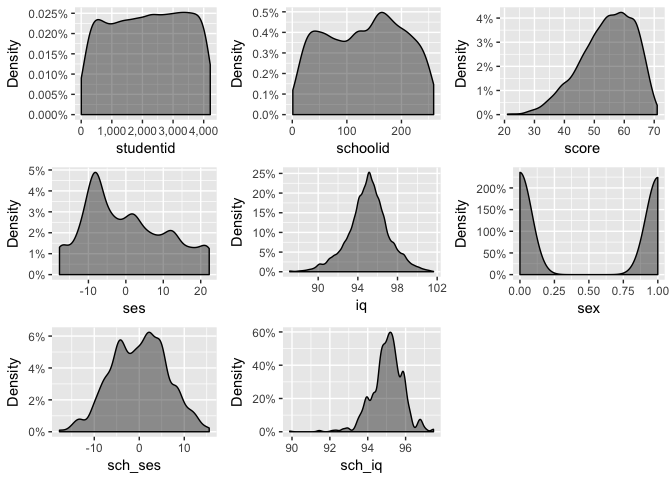

Homwork
================

環境設定
========

資料探勘
========



  首先對資料的形態和分佈進行探勘，此處使用R的繪圖功能加以檢視。由圖所示，iq和sch\_iq兩個變項需要中心化調整，否則在迴歸分析中的截距項解釋上會出現謬誤。對此本文對於iq和sch\_iq兩個變項中心化處理，對於iq變項，在一般迴歸模型中減去總平均(grand mean centering)，而在多層次模型中作為第一層的依變項，減去校平均iq(group mean centering)。而sch\_iq作為第二層模型的解釋變項，則是減去總平均(grand mean centering)的方式處理。本文中的模型和表格中對於兩變項的描述，皆是採用以上中心化處理過後的結果。

變項處理
--------

回答問題
========

1.  在不考慮學校效果的情況下，學生的家庭社會經濟地位、智力測驗成績與性別是否會影響個人數學能力測驗總分?

``` r
m1 <- lm(score ~ ses + iq.lm + sex, data = mydata)
stargazer(m1, type = "text")
```

    ## 
    ## ===============================================
    ##                         Dependent variable:    
    ##                     ---------------------------
    ##                                score           
    ## -----------------------------------------------
    ## ses                          0.150***          
    ##                               (0.011)          
    ##                                                
    ## iq.lm                        2.403***          
    ##                               (0.057)          
    ##                                                
    ## sexMale                      2.498***          
    ##                               (0.221)          
    ##                                                
    ## Constant                     53.189***         
    ##                               (0.154)          
    ##                                                
    ## -----------------------------------------------
    ## Observations                   3,758           
    ## R2                             0.422           
    ## Adjusted R2                    0.421           
    ## Residual Std. Error      6.764 (df = 3754)     
    ## F Statistic          913.134*** (df = 3; 3754) 
    ## ===============================================
    ## Note:               *p<0.1; **p<0.05; ***p<0.01

$$\\hat{y\_{i}} = \\hat{\\beta \_{0}} + \\hat{\\beta \_{1}}ses\_{i} + \\hat{\\beta \_{2}}iq\_{i} + \\hat{\\beta \_{3}}sex\_{i} + e\_{i}--- (1)$$

*H*<sub>0</sub> : *β*<sub>1</sub>, *β*<sub>2</sub>, *β*<sub>3</sub> = 0

由題幹可以導出此迴歸式(1)，依變項為個人的數學測驗的分數，整體模型可以解釋42%的變異，三個解釋變項皆有達顯著水準，社經地位每增加一單位可提高0.15分的數學分數，iq增加一單位可提高2.4分，男性比女性多出2.49分。由此可知，學生的家庭社會經濟地位、智力測驗成績與性別確實會影響個人的數學成績，且為正向的關係，而男性的成績也會高於女生。

1.  若考慮學校效果，學生的數學能力有沒有學校間的差異?

<!-- -->

    ## Computing p-values via Wald-statistics approximation (treating t as Wald z).

<table style="border-collapse:collapse; border:none;border-bottom:double;">
<td style="padding:0.2cm; border-top:double;">
 
</td>
<td style="border-bottom:1px solid; padding-left:0.5em; padding-right:0.5em; border-top:double;">
 
</td>
<td style="padding:0.2cm; text-align:center; border-bottom:1px solid; border-top:double;" colspan="3">
score
</td>
</tr>
<tr>
<td style="padding:0.2cm; font-style:italic;">
 
</td>
<td style="padding-left:0.5em; padding-right:0.5em; font-style:italic;">
 
</td>
<td style="padding:0.2cm; text-align:center; font-style:italic; ">
B
</td>
<td style="padding:0.2cm; text-align:center; font-style:italic; ">
std. Error
</td>
<td style="padding:0.2cm; text-align:center; font-style:italic; ">
p
</td>
</tr>
<tr>
<td colspan="5" style="padding:0.2cm; text-align:left; border-top:1px solid; font-weight:bold; text-align:left;">
Fixed Parts
</td>
</tr>
<tr>
<td style="padding:0.2cm; text-align:left;">
(Intercept)
</td>
<td style="padding-left:0.5em; padding-right:0.5em; ">
 
</td>
<td style="padding:0.2cm; text-align:center; ">
52.87
</td>
<td style="padding:0.2cm; text-align:center; ">
0.32
</td>
<td style="padding:0.2cm; text-align:center; ">
&lt;.001
</td>
</tr>
<tr>
<td style="padding:0.2cm; text-align:left;">
ses
</td>
<td style="padding-left:0.5em; padding-right:0.5em;">
 
</td>
<td style="padding:0.2cm; text-align:center; ">
0.18
</td>
<td style="padding:0.2cm; text-align:center; ">
0.01
</td>
<td style="padding:0.2cm; text-align:center; ">
&lt;.001
</td>
</tr>
<tr>
<td style="padding:0.2cm; text-align:left;">
grpcent\_iq
</td>
<td style="padding-left:0.5em; padding-right:0.5em;">
 
</td>
<td style="padding:0.2cm; text-align:center; ">
2.24
</td>
<td style="padding:0.2cm; text-align:center; ">
0.06
</td>
<td style="padding:0.2cm; text-align:center; ">
&lt;.001
</td>
</tr>
<tr>
<td style="padding:0.2cm; text-align:left;">
sex (Male)
</td>
<td style="padding-left:0.5em; padding-right:0.5em;">
 
</td>
<td style="padding:0.2cm; text-align:center; ">
2.40
</td>
<td style="padding:0.2cm; text-align:center; ">
0.20
</td>
<td style="padding:0.2cm; text-align:center; ">
&lt;.001
</td>
</tr>
<tr>
<td colspan="5" style="padding:0.2cm; padding-top:0.1cm; padding-bottom:0.1cm; text-align:left; font-weight:bold; text-align:left; padding-top:0.5em;">
Random Parts
</td>
</tr>
<tr>
<td style="padding:0.2cm; padding-top:0.1cm; padding-bottom:0.1cm; text-align:left;">
σ<sup>2</sup>
</td>
<td style="padding-left:0.5em; padding-right:0.5em;">
 
</td>
<td style="padding:0.2cm; text-align:center; padding-top:0.1cm; padding-bottom:0.1cm;" colspan="3">
36.836
</td>
</tr>
<tr>
<td style="padding:0.2cm; padding-top:0.1cm; padding-bottom:0.1cm; text-align:left;">
τ<sub>00, schoolid</sub>
</td>
<td style="padding-left:0.5em; padding-right:0.5em;">
 
</td>
<td style="padding:0.2cm; text-align:center; padding-top:0.1cm; padding-bottom:0.1cm;" colspan="3">
16.659
</td>
</tr>
<tr>
<td style="padding:0.2cm; padding-top:0.1cm; padding-bottom:0.1cm; text-align:left;">
N<sub>schoolid</sub>
</td>
<td style="padding-left:0.5em; padding-right:0.5em;">
 
</td>
<td style="padding:0.2cm; text-align:center; padding-top:0.1cm; padding-bottom:0.1cm;" colspan="3">
211
</td>
</tr>
<tr>
<td style="padding:0.2cm; text-align:left; padding-top:0.1cm; padding-bottom:0.1cm;">
ICC<sub>schoolid</sub>
</td>
<td style="padding-left:0.5em; padding-right:0.5em;">
 
</td>
<td style="padding:0.2cm; text-align:center; padding-top:0.1cm; padding-bottom:0.1cm;" colspan="3">
0.311
</td>
</tr>
<tr>
<td style="padding:0.2cm; padding-top:0.1cm; padding-bottom:0.1cm; text-align:left; border-top:1px solid;">
Observations
</td>
<td style="padding-left:0.5em; padding-right:0.5em; border-top:1px solid;">
 
</td>
<td style="padding:0.2cm; padding-top:0.1cm; padding-bottom:0.1cm; text-align:center; border-top:1px solid;" colspan="3">
3758
</td>
</tr>
<tr>
<td style="padding:0.2cm; text-align:left; padding-top:0.1cm; padding-bottom:0.1cm;">
R<sup>2</sup> / Ω<sub>0</sub><sup>2</sup>
</td>
<td style="padding-left:0.5em; padding-right:0.5em;">
 
</td>
<td style="padding:0.2cm; text-align:center; padding-top:0.1cm; padding-bottom:0.1cm;" colspan="3">
.558 / .557
</td>
</tr>
</table>
    ## Linear mixed model fit by REML ['lmerMod']
    ## Formula: score ~ ses + grpcent_iq + sex + (1 | schoolid)
    ##    Data: mydata
    ## 
    ## REML criterion at convergence: 24676.6
    ## 
    ## Scaled residuals: 
    ##     Min      1Q  Median      3Q     Max 
    ## -4.0643 -0.6283  0.0667  0.6932  3.3512 
    ## 
    ## Random effects:
    ##  Groups   Name        Variance Std.Dev.
    ##  schoolid (Intercept) 16.66    4.082   
    ##  Residual             36.84    6.069   
    ## Number of obs: 3758, groups:  schoolid, 211
    ## 
    ## Fixed effects:
    ##             Estimate Std. Error t value
    ## (Intercept) 52.86513    0.31656  167.00
    ## ses          0.17523    0.01114   15.74
    ## grpcent_iq   2.23784    0.05507   40.64
    ## sexMale      2.40396    0.20361   11.81
    ## 
    ## Correlation of Fixed Effects:
    ##            (Intr) ses    grpcn_
    ## ses         0.021              
    ## grpcent_iq -0.014 -0.271       
    ## sexMale    -0.309 -0.030  0.035

    ## Analysis of Random effects Table:
    ##          Chi.sq Chi.DF p.value    
    ## schoolid    801      1  <2e-16 ***
    ## ---
    ## Signif. codes:  0 '***' 0.001 '**' 0.01 '*' 0.05 '.' 0.1 ' ' 1

$$\\hat{y\_{ij}} = \\hat{\\beta \_{0j}} + \\hat{\\beta \_{1j}}SES\_{ij} + \\hat{\\beta \_{2}}IQ\_{ij} + \\hat{\\beta \_{3}}SEX\_{ij} + e\_{i} --- (2)$$

$$\\hat{\\beta \_{0j}} =  \\hat{\\gamma\_{00}} + \\hat{u\_{oj}} --- (2.1) $$

*H*<sub>0</sub> : *u*<sub>*o**j*</sub> = 0
 將學校效果考量進來，可以列出以上兩層次的模型。其中，模型2.1可以解釋為全體的平均數學能力(*γ*<sub>00</sub>)加上各校數學能力的差異(*u*<sub>*o**j*</sub>)，因此，若要檢驗學生的數學能力是否有學校間的差異，即檢驗*u*<sub>*o**j*</sub>是否為零。由結果表顯示*u*<sub>*o**j*</sub>有達到顯著水準(variance=16.66, P&lt; .001)。因此可以推論學生的數學能力確實存在學校的差異。

1.  在考慮學校效果的情況下，學生的家庭社會經濟地位、智力測驗成績與性別是否會影響個人數學能力測驗總分?(假定學生的家庭社會經濟地位、智力測驗成績與性別對個人數學能力測驗總分的影響，不隨學校的不同而有所不同)

為檢驗個人層次變項，在考量學校脈絡下的影響效果，因為假定個人層次的效果不隨學校而變動，代表了斜率效果固定，因此分析上仍是使用模型(2)，但假設則如下：
*H*<sub>0</sub> : *β*<sub>1</sub>, *β*<sub>2</sub>, *β*<sub>3</sub> = 0
 [由表@顯示](mailto:由表@顯示)，三個人層次的變項，在考量學校效果後都仍是達到顯著，社經地位每增加一單位可增加0.18分，而iq則是增加2.24分，男性則多女性2.4分。其影響效果仍是存在。

1.  請比較題1.與題3.的結果差異，試著回答如果我們忽略資料結構的群聚效果，可能產生的影響為何？

$$\\hat{y\_{ij}} = \\hat{\\gamma\_{00}} + \\hat{\\beta \_{1j}}SES\_{ij} + \\hat{\\beta \_{2}}IQ\_{ij} + \\hat{\\beta \_{3}}SEX\_{ij} + \\hat{u\_{oj}} + e\_{i} --- (2.2)$$
 比較兩題的差異，可以直接比對模型(1)和模型2的展開式(2.2)，最大的差別是增加了*u*<sub>0*j*</sub>這個學校效果的隨機項，在一般迴歸模型中會將其一併歸入誤差項之中，而無法區辨出學校的差異。更進一步檢視團體間的差異：

$$ICC = \\frac{\\tau\_{00}}{\\tau\_{00}+\\sigma ^{2}} = \\frac{16.659}{16.659 + 36.836} = 0.311$$
 這表示群體間的差異約佔了整體變異的31%，將其忽略將會喪失解釋的效力。若就理論層次來看，便是忽略了脈絡的異質性，武斷得認為影響的效果是一體適用的，無法檢視這些影響因子與環境互動的效果。

1.  在考慮學校效果的情況下，並不考量個人層次變項(學生的家庭社會經濟地位、智力測驗成績與性別)對學生數學能力的影響，學生的數學能力的學校間差異，是否可以由學校家庭社會經濟地位平均數與學校智力測驗成績所解釋?

``` r
m5 <- lmer(score ~ 1 + sch_ses + grdcentsch_iq + (1|schoolid), data = mydata)
## 如何centering?
sjt.lmer(m5, p.kr = FALSE, show.icc = T, show.se = T, separate.ci.col = F, 
         show.ci = F, p.numeric = F)
```

    ## Computing p-values via Wald-statistics approximation (treating t as Wald z).

<table style="border-collapse:collapse; border:none;">
<td style="padding:0.2cm; border-top:double;">
 
</td>
<td style="border-bottom:1px solid; padding-left:0.5em; padding-right:0.5em; border-top:double;">
 
</td>
<td style="padding:0.2cm; text-align:center; border-bottom:1px solid; border-top:double;" colspan="2">
score
</td>
</tr>
<tr>
<td style="padding:0.2cm; font-style:italic;">
 
</td>
<td style="padding-left:0.5em; padding-right:0.5em; font-style:italic;">
 
</td>
<td style="padding:0.2cm; text-align:center; font-style:italic; ">
B
</td>
<td style="padding:0.2cm; text-align:center; font-style:italic; ">
std. Error
</td>
</tr>
<tr>
<td colspan="4" style="padding:0.2cm; text-align:left; border-top:1px solid; font-weight:bold; text-align:left;">
Fixed Parts
</td>
</tr>
<tr>
<td style="padding:0.2cm; text-align:left;">
(Intercept)
</td>
<td style="padding-left:0.5em; padding-right:0.5em; ">
 
</td>
<td style="padding:0.2cm; text-align:center; ">
54.28 \*\*\*
</td>
<td style="padding:0.2cm; text-align:center; ">
0.23
</td>
</tr>
<tr>
<td style="padding:0.2cm; text-align:left;">
sch\_ses
</td>
<td style="padding-left:0.5em; padding-right:0.5em;">
 
</td>
<td style="padding:0.2cm; text-align:center; ">
0.08 
</td>
<td style="padding:0.2cm; text-align:center; ">
0.04
</td>
</tr>
<tr>
<td style="padding:0.2cm; text-align:left;">
grdcentsch\_iq
</td>
<td style="padding-left:0.5em; padding-right:0.5em;">
 
</td>
<td style="padding:0.2cm; text-align:center; ">
3.43 \*\*\*
</td>
<td style="padding:0.2cm; text-align:center; ">
0.31
</td>
</tr>
<tr>
<td colspan="4" style="padding:0.2cm; padding-top:0.1cm; padding-bottom:0.1cm; text-align:left; font-weight:bold; text-align:left; padding-top:0.5em;">
Random Parts
</td>
</tr>
<tr>
<td style="padding:0.2cm; padding-top:0.1cm; padding-bottom:0.1cm; text-align:left;">
σ<sup>2</sup>
</td>
<td style="padding-left:0.5em; padding-right:0.5em;">
 
</td>
<td style="padding:0.2cm; text-align:center; padding-top:0.1cm; padding-bottom:0.1cm;" colspan="2">
62.691
</td>
</tr>
<tr>
<td style="padding:0.2cm; padding-top:0.1cm; padding-bottom:0.1cm; text-align:left;">
τ<sub>00, schoolid</sub>
</td>
<td style="padding-left:0.5em; padding-right:0.5em;">
 
</td>
<td style="padding:0.2cm; text-align:center; padding-top:0.1cm; padding-bottom:0.1cm;" colspan="2">
7.324
</td>
</tr>
<tr>
<td style="padding:0.2cm; padding-top:0.1cm; padding-bottom:0.1cm; text-align:left;">
N<sub>schoolid</sub>
</td>
<td style="padding-left:0.5em; padding-right:0.5em;">
 
</td>
<td style="padding:0.2cm; text-align:center; padding-top:0.1cm; padding-bottom:0.1cm;" colspan="2">
211
</td>
</tr>
<tr>
<td style="padding:0.2cm; text-align:left; padding-top:0.1cm; padding-bottom:0.1cm;">
ICC<sub>schoolid</sub>
</td>
<td style="padding-left:0.5em; padding-right:0.5em;">
 
</td>
<td style="padding:0.2cm; text-align:center; padding-top:0.1cm; padding-bottom:0.1cm;" colspan="2">
0.105
</td>
</tr>
<tr>
<td style="padding:0.2cm; padding-top:0.1cm; padding-bottom:0.1cm; text-align:left; border-top:1px solid;">
Observations
</td>
<td style="padding-left:0.5em; padding-right:0.5em; border-top:1px solid;">
 
</td>
<td style="padding:0.2cm; padding-top:0.1cm; padding-bottom:0.1cm; text-align:center; border-top:1px solid;" colspan="2">
3758
</td>
</tr>
<tr>
<td style="padding:0.2cm; text-align:left; padding-top:0.1cm; padding-bottom:0.1cm;">
R<sup>2</sup> / Ω<sub>0</sub><sup>2</sup>
</td>
<td style="padding-left:0.5em; padding-right:0.5em;">
 
</td>
<td style="padding:0.2cm; text-align:center; padding-top:0.1cm; padding-bottom:0.1cm;" colspan="2">
.241 / .236
</td>
</tr>
<tr style="padding:0.2cm; border-top:1px solid;">
<td style="padding:0.2cm;">
Notes
</td>
<td style="padding:0.2cm; text-align:right;" colspan="3">
<em>\* p&lt;.05   \*\* p&lt;.01   \*\*\* p&lt;.001</em>
</td>
</tr>
</table>
$$\\hat{y\_{ij}} = \\hat{\\beta \_{0j}} + e\_{i} --- (3)$$

$$\\hat{\\beta \_{0j}} = \\hat{\\gamma\_{00}} + \\hat{\\gamma\_{01}}Schses\_{j} + \\hat{\\gamma\_{02}}Schiq\_{j}  + \\hat{u\_{oj}} --- (3.1)$$
 因為不考慮個人層次的變項，因此在模型(3)第一層模型中僅需放入截距項，並透過第二層模型的學校層次變項加以解釋。結果顯示經過中心化處理後的各學校平均iq有達到顯著水準，也就是個人所處學校平均iq每增加1單位，其數學表現也會高出總平均3.43分。這也代表了個人數學能力會受到所處學校脈絡的影響。

1.  在考慮學校效果的情況下，學生的家庭社會經濟地位、智力測驗成績與性別對學生數學能力的影響是否有學校間的差異?如果影響效果有差異，是否可以由學校家庭社會經濟地位平均數與學校智力測驗成績所解釋?

``` r
m6.1 <- lmer(score ~ ses + grpcent_iq + sex + (ses + grpcent_iq + sex|schoolid), 
             data = mydata)

m6.2 <- lmer(score ~ ses + grpcent_iq + sex + grdcentsch_iq + sch_ses +
             grdcentsch_iq*(ses + grpcent_iq + sex) + sch_ses*(ses + grpcent_iq + sex) + 
             (ses + grpcent_iq + sex|schoolid), data = mydata)

lmerTest::anova(m6.1, m6.2)
```

    ## refitting model(s) with ML (instead of REML)

    ## Data: mydata
    ## Models:
    ## m6.1: score ~ ses + grpcent_iq + sex + (ses + grpcent_iq + sex | schoolid)
    ## m6.2: score ~ ses + grpcent_iq + sex + grdcentsch_iq + sch_ses + grdcentsch_iq * 
    ## m6.2:     (ses + grpcent_iq + sex) + sch_ses * (ses + grpcent_iq + 
    ## m6.2:     sex) + (ses + grpcent_iq + sex | schoolid)
    ##      Df   AIC   BIC logLik deviance  Chisq Chi Df Pr(>Chisq)    
    ## m6.1 15 24643 24736 -12306    24613                             
    ## m6.2 23 24539 24682 -12246    24493 120.12      8  < 2.2e-16 ***
    ## ---
    ## Signif. codes:  0 '***' 0.001 '**' 0.01 '*' 0.05 '.' 0.1 ' ' 1

``` r
sjt.lmer(m6.1, m6.2, p.kr = FALSE, show.icc = T, show.se = T, separate.ci.col = F, 
         show.ci = F,  p.numeric = F)
```

    ## Computing p-values via Wald-statistics approximation (treating t as Wald z).

    ## Computing p-values via Wald-statistics approximation (treating t as Wald z).

    ## Caution! ICC for random-slope-intercept models usually not meaningful. See 'Note' in `?icc`.
    ## Caution! ICC for random-slope-intercept models usually not meaningful. See 'Note' in `?icc`.

<table style="border-collapse:collapse; border:none;">
<td style="padding:0.2cm; border-top:double;">
 
</td>
<td style="border-bottom:1px solid; padding-left:0.5em; padding-right:0.5em; border-top:double;">
 
</td>
<td style="padding:0.2cm; text-align:center; border-bottom:1px solid; border-top:double;" colspan="2">
score
</td>
<td style="border-bottom:1px solid; padding-left:0.5em; padding-right:0.5em; border-top:double;">
 
</td>
<td style="padding:0.2cm; text-align:center; border-bottom:1px solid; border-top:double;" colspan="2">
score
</td>
</tr>
<tr>
<td style="padding:0.2cm; font-style:italic;">
 
</td>
<td style="padding-left:0.5em; padding-right:0.5em; font-style:italic;">
 
</td>
<td style="padding:0.2cm; text-align:center; font-style:italic; ">
B
</td>
<td style="padding:0.2cm; text-align:center; font-style:italic; ">
std. Error
</td>
<td style="padding-left:0.5em; padding-right:0.5em; font-style:italic;">
 
</td>
<td style="padding:0.2cm; text-align:center; font-style:italic; ">
B
</td>
<td style="padding:0.2cm; text-align:center; font-style:italic; ">
std. Error
</td>
</tr>
<tr>
<td colspan="7" style="padding:0.2cm; text-align:left; border-top:1px solid; font-weight:bold; text-align:left;">
Fixed Parts
</td>
</tr>
<tr>
<td style="padding:0.2cm; text-align:left;">
(Intercept)
</td>
<td style="padding-left:0.5em; padding-right:0.5em; ">
 
</td>
<td style="padding:0.2cm; text-align:center; ">
52.84 \*\*\*
</td>
<td style="padding:0.2cm; text-align:center; ">
0.33
</td>
<td style="padding-left:0.5em; padding-right:0.5em; ">
 
</td>
<td style="padding:0.2cm; text-align:center; ">
53.09 \*\*\*
</td>
<td style="padding:0.2cm; text-align:center; ">
0.27
</td>
</tr>
<tr>
<td style="padding:0.2cm; text-align:left;">
ses
</td>
<td style="padding-left:0.5em; padding-right:0.5em;">
 
</td>
<td style="padding:0.2cm; text-align:center; ">
0.18 \*\*\*
</td>
<td style="padding:0.2cm; text-align:center; ">
0.01
</td>
<td style="padding-left:0.5em; padding-right:0.5em;">
 
</td>
<td style="padding:0.2cm; text-align:center; ">
0.17 \*\*\*
</td>
<td style="padding:0.2cm; text-align:center; ">
0.01
</td>
</tr>
<tr>
<td style="padding:0.2cm; text-align:left;">
grpcent\_iq
</td>
<td style="padding-left:0.5em; padding-right:0.5em;">
 
</td>
<td style="padding:0.2cm; text-align:center; ">
2.26 \*\*\*
</td>
<td style="padding:0.2cm; text-align:center; ">
0.07
</td>
<td style="padding-left:0.5em; padding-right:0.5em;">
 
</td>
<td style="padding:0.2cm; text-align:center; ">
2.26 \*\*\*
</td>
<td style="padding:0.2cm; text-align:center; ">
0.07
</td>
</tr>
<tr>
<td style="padding:0.2cm; text-align:left;">
sexMale
</td>
<td style="padding-left:0.5em; padding-right:0.5em;">
 
</td>
<td style="padding:0.2cm; text-align:center; ">
2.48 \*\*\*
</td>
<td style="padding:0.2cm; text-align:center; ">
0.21
</td>
<td style="padding-left:0.5em; padding-right:0.5em;">
 
</td>
<td style="padding:0.2cm; text-align:center; ">
2.44 \*\*\*
</td>
<td style="padding:0.2cm; text-align:center; ">
0.21
</td>
</tr>
<tr>
<td style="padding:0.2cm; text-align:left;">
grdcentsch\_iq
</td>
<td style="padding-left:0.5em; padding-right:0.5em;">
 
</td>
<td style="padding:0.2cm; text-align:center; ">
 
</td>
<td style="padding:0.2cm; text-align:center; ">
</td>
<td style="padding-left:0.5em; padding-right:0.5em;">
 
</td>
<td style="padding:0.2cm; text-align:center; ">
3.58 \*\*\*
</td>
<td style="padding:0.2cm; text-align:center; ">
0.34
</td>
</tr>
<tr>
<td style="padding:0.2cm; text-align:left;">
sch\_ses
</td>
<td style="padding-left:0.5em; padding-right:0.5em;">
 
</td>
<td style="padding:0.2cm; text-align:center; ">
 
</td>
<td style="padding:0.2cm; text-align:center; ">
</td>
<td style="padding-left:0.5em; padding-right:0.5em;">
 
</td>
<td style="padding:0.2cm; text-align:center; ">
-0.12 \*
</td>
<td style="padding:0.2cm; text-align:center; ">
0.05
</td>
</tr>
<tr>
<td style="padding:0.2cm; text-align:left;">
ses:grdcentsch\_iq
</td>
<td style="padding-left:0.5em; padding-right:0.5em;">
 
</td>
<td style="padding:0.2cm; text-align:center; ">
 
</td>
<td style="padding:0.2cm; text-align:center; ">
</td>
<td style="padding-left:0.5em; padding-right:0.5em;">
 
</td>
<td style="padding:0.2cm; text-align:center; ">
-0.02 
</td>
<td style="padding:0.2cm; text-align:center; ">
0.02
</td>
</tr>
<tr>
<td style="padding:0.2cm; text-align:left;">
grpcent\_iq:grdcentsch\_iq
</td>
<td style="padding-left:0.5em; padding-right:0.5em;">
 
</td>
<td style="padding:0.2cm; text-align:center; ">
 
</td>
<td style="padding:0.2cm; text-align:center; ">
</td>
<td style="padding-left:0.5em; padding-right:0.5em;">
 
</td>
<td style="padding:0.2cm; text-align:center; ">
-0.04 
</td>
<td style="padding:0.2cm; text-align:center; ">
0.09
</td>
</tr>
<tr>
<td style="padding:0.2cm; text-align:left;">
sexMale:grdcentsch\_iq
</td>
<td style="padding-left:0.5em; padding-right:0.5em;">
 
</td>
<td style="padding:0.2cm; text-align:center; ">
 
</td>
<td style="padding:0.2cm; text-align:center; ">
</td>
<td style="padding-left:0.5em; padding-right:0.5em;">
 
</td>
<td style="padding:0.2cm; text-align:center; ">
-0.58 \*
</td>
<td style="padding:0.2cm; text-align:center; ">
0.30
</td>
</tr>
<tr>
<td style="padding:0.2cm; text-align:left;">
ses:sch\_ses
</td>
<td style="padding-left:0.5em; padding-right:0.5em;">
 
</td>
<td style="padding:0.2cm; text-align:center; ">
 
</td>
<td style="padding:0.2cm; text-align:center; ">
</td>
<td style="padding-left:0.5em; padding-right:0.5em;">
 
</td>
<td style="padding:0.2cm; text-align:center; ">
0.00 
</td>
<td style="padding:0.2cm; text-align:center; ">
0.00
</td>
</tr>
<tr>
<td style="padding:0.2cm; text-align:left;">
grpcent\_iq:sch\_ses
</td>
<td style="padding-left:0.5em; padding-right:0.5em;">
 
</td>
<td style="padding:0.2cm; text-align:center; ">
 
</td>
<td style="padding:0.2cm; text-align:center; ">
</td>
<td style="padding-left:0.5em; padding-right:0.5em;">
 
</td>
<td style="padding:0.2cm; text-align:center; ">
-0.02 
</td>
<td style="padding:0.2cm; text-align:center; ">
0.01
</td>
</tr>
<tr>
<td style="padding:0.2cm; text-align:left;">
sexMale:sch\_ses
</td>
<td style="padding-left:0.5em; padding-right:0.5em;">
 
</td>
<td style="padding:0.2cm; text-align:center; ">
 
</td>
<td style="padding:0.2cm; text-align:center; ">
</td>
<td style="padding-left:0.5em; padding-right:0.5em;">
 
</td>
<td style="padding:0.2cm; text-align:center; ">
0.04 
</td>
<td style="padding:0.2cm; text-align:center; ">
0.04
</td>
</tr>
<tr>
<td colspan="7" style="padding:0.2cm; padding-top:0.1cm; padding-bottom:0.1cm; text-align:left; font-weight:bold; text-align:left; padding-top:0.5em;">
Random Parts
</td>
</tr>
<tr>
<td style="padding:0.2cm; padding-top:0.1cm; padding-bottom:0.1cm; text-align:left;">
σ<sup>2</sup>
</td>
<td style="padding-left:0.5em; padding-right:0.5em;">
 
</td>
<td style="padding:0.2cm; text-align:center; padding-top:0.1cm; padding-bottom:0.1cm;" colspan="2">
35.639
</td>
<td style="padding-left:0.5em; padding-right:0.5em;">
 
</td>
<td style="padding:0.2cm; text-align:center; padding-top:0.1cm; padding-bottom:0.1cm;" colspan="2">
35.649
</td>
</tr>
<tr>
<td style="padding:0.2cm; padding-top:0.1cm; padding-bottom:0.1cm; text-align:left;">
τ<sub>00, schoolid</sub>
</td>
<td style="padding-left:0.5em; padding-right:0.5em;">
 
</td>
<td style="padding:0.2cm; text-align:center; padding-top:0.1cm; padding-bottom:0.1cm;" colspan="2">
18.598
</td>
<td style="padding-left:0.5em; padding-right:0.5em;">
 
</td>
<td style="padding:0.2cm; text-align:center; padding-top:0.1cm; padding-bottom:0.1cm;" colspan="2">
9.995
</td>
</tr>
<tr>
<td style="padding:0.2cm; padding-top:0.1cm; padding-bottom:0.1cm; text-align:left;">
ρ<sub>01</sub>
</td>
<td style="padding-left:0.5em; padding-right:0.5em;">
 
</td>
<td style="padding:0.2cm; text-align:center; padding-top:0.1cm; padding-bottom:0.1cm;" colspan="2">
-0.427
</td>
<td style="padding-left:0.5em; padding-right:0.5em;">
 
</td>
<td style="padding:0.2cm; text-align:center; padding-top:0.1cm; padding-bottom:0.1cm;" colspan="2">
-0.175
</td>
</tr>
<tr>
<td style="padding:0.2cm; padding-top:0.1cm; padding-bottom:0.1cm; text-align:left;">
N<sub>schoolid</sub>
</td>
<td style="padding-left:0.5em; padding-right:0.5em;">
 
</td>
<td style="padding:0.2cm; text-align:center; padding-top:0.1cm; padding-bottom:0.1cm;" colspan="2">
211
</td>
<td style="padding-left:0.5em; padding-right:0.5em;">
 
</td>
<td style="padding:0.2cm; text-align:center; padding-top:0.1cm; padding-bottom:0.1cm;" colspan="2">
211
</td>
</tr>
<tr>
<td style="padding:0.2cm; text-align:left; padding-top:0.1cm; padding-bottom:0.1cm;">
ICC<sub>schoolid</sub>
</td>
<td style="padding-left:0.5em; padding-right:0.5em;">
 
</td>
<td style="padding:0.2cm; text-align:center; padding-top:0.1cm; padding-bottom:0.1cm;" colspan="2">
0.343
</td>
<td style="padding-left:0.5em; padding-right:0.5em;">
 
</td>
<td style="padding:0.2cm; text-align:center; padding-top:0.1cm; padding-bottom:0.1cm;" colspan="2">
0.219
</td>
</tr>
<tr>
<td style="padding:0.2cm; padding-top:0.1cm; padding-bottom:0.1cm; text-align:left; border-top:1px solid;">
Observations
</td>
<td style="padding-left:0.5em; padding-right:0.5em; border-top:1px solid;">
 
</td>
<td style="padding:0.2cm; padding-top:0.1cm; padding-bottom:0.1cm; text-align:center; border-top:1px solid;" colspan="2">
3758
</td>
<td style="padding-left:0.5em; padding-right:0.5em; border-top:1px solid;">
 
</td>
<td style="padding:0.2cm; padding-top:0.1cm; padding-bottom:0.1cm; text-align:center; border-top:1px solid;" colspan="2">
3758
</td>
</tr>
<tr>
<td style="padding:0.2cm; text-align:left; padding-top:0.1cm; padding-bottom:0.1cm;">
R<sup>2</sup> / Ω<sub>0</sub><sup>2</sup>
</td>
<td style="padding-left:0.5em; padding-right:0.5em;">
 
</td>
<td style="padding:0.2cm; text-align:center; padding-top:0.1cm; padding-bottom:0.1cm;" colspan="2">
.580 / .579
</td>
<td style="padding-left:0.5em; padding-right:0.5em;">
 
</td>
<td style="padding:0.2cm; text-align:center; padding-top:0.1cm; padding-bottom:0.1cm;" colspan="2">
.578 / .577
</td>
</tr>
<tr style="padding:0.2cm; border-top:1px solid;">
<td style="padding:0.2cm;">
Notes
</td>
<td style="padding:0.2cm; text-align:right;" colspan="6">
<em>\* p&lt;.05   \*\* p&lt;.01   \*\*\* p&lt;.001</em>
</td>
</tr>
</table>
$$\\hat{y\_{ij}} = \\hat{\\beta \_{0j}} + \\hat{\\beta \_{1j}}SES\_{ij} + \\hat{\\beta \_{2}}IQ\_{ij} + \\hat{\\beta \_{3}}SEX\_{ij} + e\_{i} --- (4)$$

$$\\hat{\\beta \_{0j}} =  \\hat{\\gamma\_{00}} + \\hat{u\_{oj}} --- (4.1)$$

$$\\hat{\\beta \_{1j}} =  \\hat{\\gamma\_{10}} + \\hat{u\_{1j}} --- (4.2)$$

$$\\hat{\\beta \_{2j}} =  \\hat{\\gamma\_{20}} + \\hat{u\_{2j}} --- (4.3)$$

$$\\hat{\\beta \_{3j}} =  \\hat{\\gamma\_{30}} + \\hat{u\_{3j}} --- (4.4) $$
 考量學校的效果後，為檢驗個人層次變項是否會因學校而有不同，考量隨機截距和斜率可以列出以上4個模型，由下表的結果顯示三者皆有達到統計水準，表示其影響效果確實會隨學校而不同。進一步考量影響效果的差異，可以列出下面的式子：

$$\\hat{\\beta \_{kj}} = \\hat{\\gamma\_{k0}} + \\hat{\\gamma\_{k1}}Schses\_{j} + \\hat{\\gamma\_{k2}}Schiq\_{j}  + \\hat{u\_{kj}} --- (4.5)$$

*k* = 0, 1, 2, 3

*H*<sub>0</sub> : *γ*<sub>*k*1</sub>, *γ*<sub>*k*2</sub> = 0
 首先透過模型比較的方式，[模型@的BIC和AIC皆小於前者](mailto:模型@的BIC和AIC皆小於前者)，卡方檢定的結果也打顯著，[因此模型@的配適度較為優異](mailto:因此模型@的配適度較為優異)，應選用後者的模型。進一步觀察研究結果，由下表的結果來看，先由截距項來解釋，總體的數學平均約為53分，學校平均iq每增加1單位個人的數學成績會高出3.58分，學校平均社經地位增加1單位則會減少0.12分，但其僅是略高於顯著水準而已，由此可知兩者可以解釋學校間數學能力的差異，個人層次的變項來看，社經地位提高1單位學生數學成績可以提高0.17分，iq則可以提高2.66分，而男性高於女性2.44分。影響效果的差異來看，考量跨層次的交互作用，僅有性別和學校平均iq間的關係達到顯著水準，結果顯示，男性所身處的學校平均iq提高1個單位，反而會減少0.58分，也就是在高iq的學校環境，男性和女性的數學能力差異會下降。
