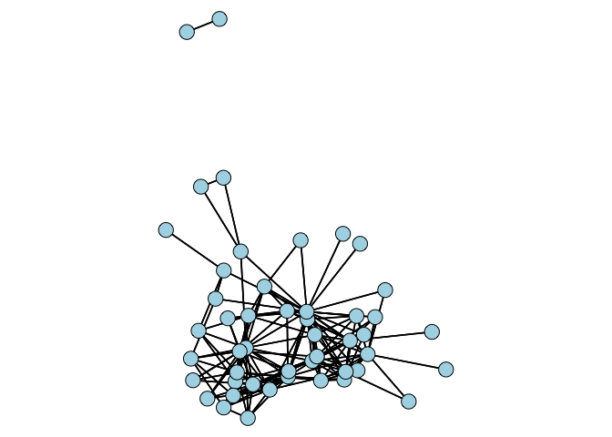

A User’s Guide to Network Analysis in R\_my note
================

Charpter 2
==========

Simple Visualization
--------------------

``` r
if (!require("pacman")) install.packages("pacman") # `pacman`用於確認套件是否安裝
```

    ## Loading required package: pacman

``` r
pacman::p_load(statnet, UserNetR)
data(Moreno)
gender <- Moreno %v% "gender"
plot(Moreno, vertex.col = gender + 2, vertex.cex = 1.2)
```


### Size

> The size is simply the number of members, usually called nodes, vertices or actors.

``` r
summary(Moreno,print.adj = FALSE)
```

    ## Network attributes:
    ##   vertices = 33
    ##   directed = FALSE
    ##   hyper = FALSE
    ##   loops = FALSE
    ##   multiple = FALSE
    ##   bipartite = FALSE
    ##  total edges = 46 
    ##    missing edges = 0 
    ##    non-missing edges = 46 
    ##  density = 0.08712121 
    ## 
    ## Vertex attributes:
    ## 
    ##  gender:
    ##    numeric valued attribute
    ##    attribute summary:
    ##    Min. 1st Qu.  Median    Mean 3rd Qu.    Max. 
    ##   1.000   1.000   2.000   1.515   2.000   2.000 
    ##   vertex.names:
    ##    character valued attribute
    ##    33 valid vertex names
    ## 
    ## No edge attributes

``` r
components(Moreno)
```

    ## Node 1, Reach 31, Total 31
    ## Node 2, Reach 31, Total 62
    ## Node 3, Reach 31, Total 93
    ## Node 4, Reach 31, Total 124
    ## Node 5, Reach 31, Total 155
    ## Node 6, Reach 31, Total 186
    ## Node 7, Reach 31, Total 217
    ## Node 8, Reach 31, Total 248
    ## Node 9, Reach 31, Total 279
    ## Node 10, Reach 31, Total 310
    ## Node 11, Reach 31, Total 341
    ## Node 12, Reach 31, Total 372
    ## Node 13, Reach 31, Total 403
    ## Node 14, Reach 31, Total 434
    ## Node 15, Reach 31, Total 465
    ## Node 16, Reach 31, Total 496
    ## Node 17, Reach 31, Total 527
    ## Node 18, Reach 31, Total 558
    ## Node 19, Reach 31, Total 589
    ## Node 20, Reach 31, Total 620
    ## Node 21, Reach 31, Total 651
    ## Node 22, Reach 31, Total 682
    ## Node 23, Reach 31, Total 713
    ## Node 24, Reach 31, Total 744
    ## Node 25, Reach 31, Total 775
    ## Node 26, Reach 31, Total 806
    ## Node 27, Reach 31, Total 837
    ## Node 28, Reach 31, Total 868
    ## Node 29, Reach 31, Total 899
    ## Node 30, Reach 31, Total 930
    ## Node 31, Reach 31, Total 961
    ## Node 32, Reach 2, Total 963
    ## Node 33, Reach 2, Total 965

    ## [1] 2

``` r
network.size(Moreno)
```

    ## [1] 33

### Density

> Density is the proportion of observed ties (also called edges, arcs, or relations) in a network to the maximum number of possible ties.

**Directed Network**

$$Density = \\frac{L}{k(k - 1)}$$
 **Undirected Network**

$$Density = \\frac{2L}{k(k - 1)}$$

``` r
gden(Moreno)
```

    ## [1] 0.08712121

### Diameter

> The diameter then for an entire network is the longest of the shortest paths across all pairs of nodes.

``` r
lgc <- component.largest(Moreno, result = "graph")
```

    ## Node 1, Reach 31, Total 31
    ## Node 2, Reach 31, Total 62
    ## Node 3, Reach 31, Total 93
    ## Node 4, Reach 31, Total 124
    ## Node 5, Reach 31, Total 155
    ## Node 6, Reach 31, Total 186
    ## Node 7, Reach 31, Total 217
    ## Node 8, Reach 31, Total 248
    ## Node 9, Reach 31, Total 279
    ## Node 10, Reach 31, Total 310
    ## Node 11, Reach 31, Total 341
    ## Node 12, Reach 31, Total 372
    ## Node 13, Reach 31, Total 403
    ## Node 14, Reach 31, Total 434
    ## Node 15, Reach 31, Total 465
    ## Node 16, Reach 31, Total 496
    ## Node 17, Reach 31, Total 527
    ## Node 18, Reach 31, Total 558
    ## Node 19, Reach 31, Total 589
    ## Node 20, Reach 31, Total 620
    ## Node 21, Reach 31, Total 651
    ## Node 22, Reach 31, Total 682
    ## Node 23, Reach 31, Total 713
    ## Node 24, Reach 31, Total 744
    ## Node 25, Reach 31, Total 775
    ## Node 26, Reach 31, Total 806
    ## Node 27, Reach 31, Total 837
    ## Node 28, Reach 31, Total 868
    ## Node 29, Reach 31, Total 899
    ## Node 30, Reach 31, Total 930
    ## Node 31, Reach 31, Total 961
    ## Node 32, Reach 2, Total 963
    ## Node 33, Reach 2, Total 965

``` r
(gd <- geodist(lgc)) ##點與點間的距離
```

    ## $counts
    ##       [,1] [,2] [,3] [,4] [,5] [,6] [,7] [,8] [,9] [,10] [,11] [,12] [,13]
    ##  [1,]    1    1    2    2    1    1    2    4    1     1     1     1     1
    ##  [2,]    1    1    1    1    1    1    1    2    1     1     1     1     1
    ##  [3,]    2    1    1    1    2    2    1    2    1     1     1     1     1
    ##  [4,]    2    1    1    1    3    2    1    1    1     1     1     1     1
    ##  [5,]    1    1    2    3    1    1    1    1    1     1     1     1     1
    ##  [6,]    1    1    2    2    1    1    3    5    1     1     1     1     1
    ##  [7,]    2    1    1    1    1    3    1    1    1     1     1     1     1
    ##  [8,]    4    2    2    1    1    5    1    1    1     1     1     1     1
    ##  [9,]    1    1    1    1    1    1    1    1    1     1     1     1     1
    ## [10,]    1    1    1    1    1    1    1    1    1     1     1     1     1
    ## [11,]    1    1    1    1    1    1    1    1    1     1     1     1     1
    ## [12,]    1    1    1    1    1    1    1    1    1     1     1     1     1
    ## [13,]    1    1    1    1    1    1    1    1    1     1     1     1     1
    ## [14,]    1    1    1    1    1    1    1    1    1     1     1     1     2
    ## [15,]    1    1    1    1    1    1    1    1    1     1     1     1     1
    ## [16,]    1    2    1    1    1    1    1    2    1     1     1     1     1
    ## [17,]    1    2    1    1    1    1    1    1    1     1     1     1     1
    ## [18,]    1    1    2    2    1    1    2    4    1     1     1     1     1
    ## [19,]    1    1    2    2    1    1    2    4    1     1     1     1     1
    ## [20,]    1    1    2    2    1    1    2    4    1     1     1     1     1
    ## [21,]    2    2    4    4    2    2    4    8    2     2     2     2     2
    ## [22,]    2    2    4    4    2    2    4    8    2     2     2     2     2
    ## [23,]    2    2    4    4    2    2    4    8    2     2     2     2     2
    ## [24,]    2    2    4    4    2    2    4    8    2     2     2     2     2
    ## [25,]    1    1    2    2    1    1    2    4    1     1     1     1     1
    ## [26,]    1    1    2    2    1    1    2    4    1     1     1     1     1
    ## [27,]    1    1    2    2    1    1    2    4    1     1     1     1     1
    ## [28,]    1    1    2    2    1    1    2    4    1     1     1     1     1
    ## [29,]    1    1    2    2    1    1    2    4    1     1     1     1     1
    ## [30,]    1    1    2    2    1    1    2    4    1     1     1     1     1
    ## [31,]    1    1    2    2    1    1    2    4    1     1     1     1     1
    ##       [,14] [,15] [,16] [,17] [,18] [,19] [,20] [,21] [,22] [,23] [,24]
    ##  [1,]     1     1     1     1     1     1     1     2     2     2     2
    ##  [2,]     1     1     2     2     1     1     1     2     2     2     2
    ##  [3,]     1     1     1     1     2     2     2     4     4     4     4
    ##  [4,]     1     1     1     1     2     2     2     4     4     4     4
    ##  [5,]     1     1     1     1     1     1     1     2     2     2     2
    ##  [6,]     1     1     1     1     1     1     1     2     2     2     2
    ##  [7,]     1     1     1     1     2     2     2     4     4     4     4
    ##  [8,]     1     1     2     1     4     4     4     8     8     8     8
    ##  [9,]     1     1     1     1     1     1     1     2     2     2     2
    ## [10,]     1     1     1     1     1     1     1     2     2     2     2
    ## [11,]     1     1     1     1     1     1     1     2     2     2     2
    ## [12,]     1     1     1     1     1     1     1     2     2     2     2
    ## [13,]     2     1     1     1     1     1     1     2     2     2     2
    ## [14,]     1     1     1     1     1     1     1     2     2     2     2
    ## [15,]     1     1     1     1     1     1     1     2     2     2     2
    ## [16,]     1     1     1     2     1     1     1     2     2     2     2
    ## [17,]     1     1     2     1     1     1     1     2     2     2     2
    ## [18,]     1     1     1     1     1     1     1     2     2     2     2
    ## [19,]     1     1     1     1     1     1     1     3     3     3     1
    ## [20,]     1     1     1     1     1     1     1     1     1     1     1
    ## [21,]     2     2     2     2     2     3     1     1     1     1     1
    ## [22,]     2     2     2     2     2     3     1     1     1     1     1
    ## [23,]     2     2     2     2     2     3     1     1     1     1     1
    ## [24,]     2     2     2     2     2     1     1     1     1     1     1
    ## [25,]     1     1     1     1     1     1     1     1     1     1     1
    ## [26,]     1     1     1     1     1     2     1     1     1     1     2
    ## [27,]     1     1     1     1     1     1     2     1     1     1     1
    ## [28,]     1     1     1     1     1     1     2     1     1     1     1
    ## [29,]     1     1     1     1     1     1     2     1     1     1     1
    ## [30,]     1     1     1     1     1     1     1     1     1     1     1
    ## [31,]     1     1     1     1     1     1     2     1     1     1     1
    ##       [,25] [,26] [,27] [,28] [,29] [,30] [,31]
    ##  [1,]     1     1     1     1     1     1     1
    ##  [2,]     1     1     1     1     1     1     1
    ##  [3,]     2     2     2     2     2     2     2
    ##  [4,]     2     2     2     2     2     2     2
    ##  [5,]     1     1     1     1     1     1     1
    ##  [6,]     1     1     1     1     1     1     1
    ##  [7,]     2     2     2     2     2     2     2
    ##  [8,]     4     4     4     4     4     4     4
    ##  [9,]     1     1     1     1     1     1     1
    ## [10,]     1     1     1     1     1     1     1
    ## [11,]     1     1     1     1     1     1     1
    ## [12,]     1     1     1     1     1     1     1
    ## [13,]     1     1     1     1     1     1     1
    ## [14,]     1     1     1     1     1     1     1
    ## [15,]     1     1     1     1     1     1     1
    ## [16,]     1     1     1     1     1     1     1
    ## [17,]     1     1     1     1     1     1     1
    ## [18,]     1     1     1     1     1     1     1
    ## [19,]     1     2     1     1     1     1     1
    ## [20,]     1     1     2     2     2     1     2
    ## [21,]     1     1     1     1     1     1     1
    ## [22,]     1     1     1     1     1     1     1
    ## [23,]     1     1     1     1     1     1     1
    ## [24,]     1     2     1     1     1     1     1
    ## [25,]     1     1     3     3     3     1     1
    ## [26,]     1     1     1     1     1     1     1
    ## [27,]     3     1     1     1     1     1     1
    ## [28,]     3     1     1     1     1     1     1
    ## [29,]     3     1     1     1     1     1     1
    ## [30,]     1     1     1     1     1     1     1
    ## [31,]     1     1     1     1     1     1     1
    ## 
    ## $gdist
    ##       [,1] [,2] [,3] [,4] [,5] [,6] [,7] [,8] [,9] [,10] [,11] [,12] [,13]
    ##  [1,]    0    1    2    3    1    1    3    4    3     4     2     6     6
    ##  [2,]    1    0    1    2    2    2    2    3    3     4     3     6     6
    ##  [3,]    2    1    0    1    3    3    1    2    2     3     3     5     5
    ##  [4,]    3    2    1    0    4    4    1    1    2     3     3     5     5
    ##  [5,]    1    2    3    4    0    1    3    4    2     3     1     5     5
    ##  [6,]    1    2    3    4    1    0    4    5    3     4     2     6     6
    ##  [7,]    3    2    1    1    3    4    0    1    1     2     2     4     4
    ##  [8,]    4    3    2    1    4    5    1    0    2     3     3     5     5
    ##  [9,]    3    3    2    2    2    3    1    2    0     1     1     3     3
    ## [10,]    4    4    3    3    3    4    2    3    1     0     2     2     2
    ## [11,]    2    3    3    3    1    2    2    3    1     2     0     4     4
    ## [12,]    6    6    5    5    5    6    4    5    3     2     4     0     1
    ## [13,]    6    6    5    5    5    6    4    5    3     2     4     1     0
    ## [14,]    6    6    5    5    5    6    4    5    3     2     4     1     2
    ## [15,]    5    5    4    4    4    5    3    4    2     1     3     1     1
    ## [16,]    1    2    1    2    2    2    2    3    3     4     3     6     6
    ## [17,]    3    4    3    3    2    3    2    3    1     2     1     4     4
    ## [18,]    1    2    3    4    2    2    4    5    4     5     3     7     7
    ## [19,]    2    3    4    5    3    3    5    6    5     6     4     8     8
    ## [20,]    2    3    4    5    3    3    5    6    5     6     4     8     8
    ## [21,]    4    5    6    7    5    5    7    8    7     8     6    10    10
    ## [22,]    5    6    7    8    6    6    8    9    8     9     7    11    11
    ## [23,]    5    6    7    8    6    6    8    9    8     9     7    11    11
    ## [24,]    3    4    5    6    4    4    6    7    6     7     5     9     9
    ## [25,]    3    4    5    6    4    4    6    7    6     7     5     9     9
    ## [26,]    3    4    5    6    4    4    6    7    6     7     5     9     9
    ## [27,]    3    4    5    6    4    4    6    7    6     7     5     9     9
    ## [28,]    3    4    5    6    4    4    6    7    6     7     5     9     9
    ## [29,]    2    3    4    5    3    3    5    6    5     6     4     8     8
    ## [30,]    2    3    4    5    3    3    5    6    5     6     4     8     8
    ## [31,]    3    4    5    6    4    4    6    7    6     7     5     9     9
    ##       [,14] [,15] [,16] [,17] [,18] [,19] [,20] [,21] [,22] [,23] [,24]
    ##  [1,]     6     5     1     3     1     2     2     4     5     5     3
    ##  [2,]     6     5     2     4     2     3     3     5     6     6     4
    ##  [3,]     5     4     1     3     3     4     4     6     7     7     5
    ##  [4,]     5     4     2     3     4     5     5     7     8     8     6
    ##  [5,]     5     4     2     2     2     3     3     5     6     6     4
    ##  [6,]     6     5     2     3     2     3     3     5     6     6     4
    ##  [7,]     4     3     2     2     4     5     5     7     8     8     6
    ##  [8,]     5     4     3     3     5     6     6     8     9     9     7
    ##  [9,]     3     2     3     1     4     5     5     7     8     8     6
    ## [10,]     2     1     4     2     5     6     6     8     9     9     7
    ## [11,]     4     3     3     1     3     4     4     6     7     7     5
    ## [12,]     1     1     6     4     7     8     8    10    11    11     9
    ## [13,]     2     1     6     4     7     8     8    10    11    11     9
    ## [14,]     0     1     6     4     7     8     8    10    11    11     9
    ## [15,]     1     0     5     3     6     7     7     9    10    10     8
    ## [16,]     6     5     0     4     2     3     3     5     6     6     4
    ## [17,]     4     3     4     0     4     5     5     7     8     8     6
    ## [18,]     7     6     2     4     0     1     1     3     4     4     2
    ## [19,]     8     7     3     5     1     0     1     4     5     5     2
    ## [20,]     8     7     3     5     1     1     0     3     4     4     1
    ## [21,]    10     9     5     7     3     4     3     0     1     1     3
    ## [22,]    11    10     6     8     4     5     4     1     0     1     4
    ## [23,]    11    10     6     8     4     5     4     1     1     0     4
    ## [24,]     9     8     4     6     2     2     1     3     4     4     0
    ## [25,]     9     8     4     6     2     2     1     2     3     3     2
    ## [26,]     9     8     4     6     2     3     2     1     2     2     3
    ## [27,]     9     8     4     6     2     3     3     3     4     4     2
    ## [28,]     9     8     4     6     2     3     3     3     4     4     2
    ## [29,]     8     7     3     5     1     2     2     2     3     3     1
    ## [30,]     8     7     3     5     1     2     2     2     3     3     2
    ## [31,]     9     8     4     6     2     3     3     1     2     2     2
    ##       [,25] [,26] [,27] [,28] [,29] [,30] [,31]
    ##  [1,]     3     3     3     3     2     2     3
    ##  [2,]     4     4     4     4     3     3     4
    ##  [3,]     5     5     5     5     4     4     5
    ##  [4,]     6     6     6     6     5     5     6
    ##  [5,]     4     4     4     4     3     3     4
    ##  [6,]     4     4     4     4     3     3     4
    ##  [7,]     6     6     6     6     5     5     6
    ##  [8,]     7     7     7     7     6     6     7
    ##  [9,]     6     6     6     6     5     5     6
    ## [10,]     7     7     7     7     6     6     7
    ## [11,]     5     5     5     5     4     4     5
    ## [12,]     9     9     9     9     8     8     9
    ## [13,]     9     9     9     9     8     8     9
    ## [14,]     9     9     9     9     8     8     9
    ## [15,]     8     8     8     8     7     7     8
    ## [16,]     4     4     4     4     3     3     4
    ## [17,]     6     6     6     6     5     5     6
    ## [18,]     2     2     2     2     1     1     2
    ## [19,]     2     3     3     3     2     2     3
    ## [20,]     1     2     3     3     2     2     3
    ## [21,]     2     1     3     3     2     2     1
    ## [22,]     3     2     4     4     3     3     2
    ## [23,]     3     2     4     4     3     3     2
    ## [24,]     2     3     2     2     1     2     2
    ## [25,]     0     1     4     4     3     2     3
    ## [26,]     1     0     3     3     2     1     2
    ## [27,]     4     3     0     1     1     2     2
    ## [28,]     4     3     1     0     1     2     2
    ## [29,]     3     2     1     1     0     1     1
    ## [30,]     2     1     2     2     1     0     2
    ## [31,]     3     2     2     2     1     2     0

``` r
max(gd$gdist)
```

    ## [1] 11

### Clustering Coefficient

> the presence of clustering, or the tendency to formed closed triangles.

``` r
gtrans(Moreno, mode = "graph")
```

    ## [1] 0.2857143

Network Data Management in R
============================

``` r
# Netwrok data
netmat1 <- rbind(c(0, 1, 1, 0, 0), c(0, 0, 1, 1, 0), c(0, 1, 0, 0, 0), 
                 c(0, 0, 0, 0, 0), c(0, 0, 1, 0, 0))
rownames(netmat1) <- c("A", "B", "C", "D", "E")
colnames(netmat1) <- c("A", "B", "C", "D", "E")
net1 <- network(netmat1, matrix.type = "adjacency")
class(net1)
```

    ## [1] "network"

``` r
summary(net1)
```

    ## Network attributes:
    ##   vertices = 5
    ##   directed = TRUE
    ##   hyper = FALSE
    ##   loops = FALSE
    ##   multiple = FALSE
    ##   bipartite = FALSE
    ##  total edges = 6 
    ##    missing edges = 0 
    ##    non-missing edges = 6 
    ##  density = 0.3 
    ## 
    ## Vertex attributes:
    ##   vertex.names:
    ##    character valued attribute
    ##    5 valid vertex names
    ## 
    ## No edge attributes
    ## 
    ## Network adjacency matrix:
    ##   A B C D E
    ## A 0 1 1 0 0
    ## B 0 0 1 1 0
    ## C 0 1 0 0 0
    ## D 0 0 0 0 0
    ## E 0 0 1 0 0

``` r
gplot(net1, vertex.col = 2, displaylabels = TRUE) ## `2`是紅色
```


``` r
as.sociomatrix(net1) ## 轉為網絡矩陣
```

    ##   A B C D E
    ## A 0 1 1 0 0
    ## B 0 0 1 1 0
    ## C 0 1 0 0 0
    ## D 0 0 0 0 0
    ## E 0 0 1 0 0

``` r
as.matrix(net1, matrix.type = "edgelist") ## 關係list
```

    ##      [,1] [,2]
    ## [1,]    1    2
    ## [2,]    3    2
    ## [3,]    1    3
    ## [4,]    2    3
    ## [5,]    5    3
    ## [6,]    2    4
    ## attr(,"n")
    ## [1] 5
    ## attr(,"vnames")
    ## [1] "A" "B" "C" "D" "E"

``` r
netmat2 <- rbind(c(1, 2), c(1, 3), c(2, 3), c(2, 4), c(3, 2), c(5, 3))
net2 <- network(netmat2, matrix.type = "edgelist")
network.vertex.names(net2) <- c("A", "B", "C", "D", "E")
summary(net2)
```

    ## Network attributes:
    ##   vertices = 5
    ##   directed = TRUE
    ##   hyper = FALSE
    ##   loops = FALSE
    ##   multiple = FALSE
    ##   bipartite = FALSE
    ##  total edges = 6 
    ##    missing edges = 0 
    ##    non-missing edges = 6 
    ##  density = 0.3 
    ## 
    ## Vertex attributes:
    ##   vertex.names:
    ##    character valued attribute
    ##    5 valid vertex names
    ## 
    ## No edge attributes
    ## 
    ## Network adjacency matrix:
    ##   A B C D E
    ## A 0 1 1 0 0
    ## B 0 0 1 1 0
    ## C 0 1 0 0 0
    ## D 0 0 0 0 0
    ## E 0 0 1 0 0

``` r
set.vertex.attribute(net1, "gender", c("F", "F", "M", "F", "M"))
net1 %v% "alldeg" <- degree(net1) ## 給予每個vertic點度
list.vertex.attributes(net1)
```

    ## [1] "alldeg"       "gender"       "na"           "vertex.names"

``` r
summary(net1)
```

    ## Network attributes:
    ##   vertices = 5
    ##   directed = TRUE
    ##   hyper = FALSE
    ##   loops = FALSE
    ##   multiple = FALSE
    ##   bipartite = FALSE
    ##  total edges = 6 
    ##    missing edges = 0 
    ##    non-missing edges = 6 
    ##  density = 0.3 
    ## 
    ## Vertex attributes:
    ## 
    ##  alldeg:
    ##    numeric valued attribute
    ##    attribute summary:
    ##    Min. 1st Qu.  Median    Mean 3rd Qu.    Max. 
    ##     1.0     1.0     2.0     2.4     4.0     4.0 
    ## 
    ##  gender:
    ##    character valued attribute
    ##    attribute summary:
    ## F M 
    ## 3 2 
    ##   vertex.names:
    ##    character valued attribute
    ##    5 valid vertex names
    ## 
    ## No edge attributes
    ## 
    ## Network adjacency matrix:
    ##   A B C D E
    ## A 0 1 1 0 0
    ## B 0 0 1 1 0
    ## C 0 1 0 0 0
    ## D 0 0 0 0 0
    ## E 0 0 1 0 0

``` r
get.vertex.attribute(net1, "gender")
```

    ## [1] "F" "F" "M" "F" "M"

``` r
net1 %v% "alldeg"
```

    ## [1] 2 4 4 1 1

``` r
list.edge.attributes(net1)
```

    ## [1] "na"

``` r
set.edge.attribute(net1, "rndval", runif(network.size(net1), 0, 1))
## 給予每個關係一個隨機數值
summary(net1 %e% "rndval")
```

    ##    Min. 1st Qu.  Median    Mean 3rd Qu.    Max. 
    ##  0.0367  0.5052  0.7179  0.5729  0.7274  0.8003

``` r
summary(get.edge.attribute(net1, "rndval"))
```

    ##    Min. 1st Qu.  Median    Mean 3rd Qu.    Max. 
    ##  0.0367  0.5052  0.7179  0.5729  0.7274  0.8003

``` r
netval1 <- rbind(c(0, 2, 3, 0, 0), c(0, 0, 3, 1, 0), c(0, 1, 0, 0, 0),
                 c(0, 0, 0, 0, 0), c(0, 0, 2, 0, 0))
netval1 <- network(netval1, matrix.type = "adjacency", ignore.eval = FALSE, names.eval = "like")
network.vertex.names(netval1) <- c("A", "B", "C", "D", "E")
list.edge.attributes(netval1)
```

    ## [1] "like" "na"

``` r
get.edge.attribute(netval1, "like")
```

    ## [1] 2 1 3 3 2 1

``` r
as.sociomatrix(netval1)
```

    ##   A B C D E
    ## A 0 1 1 0 0
    ## B 0 0 1 1 0
    ## C 0 1 0 0 0
    ## D 0 0 0 0 0
    ## E 0 0 1 0 0

-   `%v%` 代表了提取*vector*資料
-   `network.vertex.names()` 給予vertic名稱
-   `set.vertex.attribute()` 給予vertic性質
-   `list.vertex.attributes` 列出所有vertic具有的性質
-   `get.vertex.attribute(data, attr)` 列出各vertic具有的某性質

Creating a Network Object in igraph
-----------------------------------

``` r
if (require(statnet)) detach(package:statnet) 
library(igraph)
```

    ## 
    ## Attaching package: 'igraph'

    ## The following objects are masked from 'package:sna':
    ## 
    ##     betweenness, bonpow, closeness, components, degree,
    ##     dyad.census, evcent, hierarchy, is.connected, neighborhood,
    ##     triad.census

    ## The following objects are masked from 'package:network':
    ## 
    ##     %c%, %s%, add.edges, add.vertices, delete.edges,
    ##     delete.vertices, get.edge.attribute, get.edges,
    ##     get.vertex.attribute, is.bipartite, is.directed,
    ##     list.edge.attributes, list.vertex.attributes,
    ##     set.edge.attribute, set.vertex.attribute

    ## The following objects are masked from 'package:stats':
    ## 
    ##     decompose, spectrum

    ## The following object is masked from 'package:base':
    ## 
    ##     union

``` r
inet1 <- graph.adjacency(netmat1)
summary(inet1)
```

    ## IGRAPH 5636ac6 DN-- 5 6 -- 
    ## + attr: name (v/c)

``` r
inet2 <- graph.edgelist(netmat2)
V(inet2)$name <- c("A","B","C","D","E") 
E(inet2)$val <- c(1:6)
summary(inet2)
```

    ## IGRAPH 692b39a DN-- 5 6 -- 
    ## + attr: name (v/c), val (e/n)

-   `graph.adjacency()` 製作關係資料

Importing Network Data
----------------------

### 讀取外部資料

``` r
if (require(igraph)) detach("package:igraph", unload = TRUE)
library(statnet)
```

    ## 
    ## statnet: version 2016.9, created on 2016-08-29
    ## Copyright (c) 2016, Mark S. Handcock, University of California -- Los Angeles
    ##                     David R. Hunter, Penn State University
    ##                     Carter T. Butts, University of California -- Irvine
    ##                     Steven M. Goodreau, University of Washington
    ##                     Pavel N. Krivitsky, University of Wollongong
    ##                     Skye Bender-deMoll
    ##                     Martina Morris, University of Washington
    ## Based on "statnet" project software (statnet.org).
    ## For license and citation information see statnet.org/attribution
    ## or type citation("statnet").

    ## unable to reach CRAN

``` r
netmat3 <- rbind(c("A", "B"), c("A", "C"), c("B", "C"), c("B", "D"), c("C", "B"), 
                 c("E", "C"))
net.df <- data.frame(netmat3)
net.df
```

    ##   X1 X2
    ## 1  A  B
    ## 2  A  C
    ## 3  B  C
    ## 4  B  D
    ## 5  C  B
    ## 6  E  C

``` r
write.csv(net.df, file = "MyData.csv", row.names = FALSE)
(net.edge <- read.csv(file = "MyData.csv")) ## 讀取外部檔案
```

    ##   X1 X2
    ## 1  A  B
    ## 2  A  C
    ## 3  B  C
    ## 4  B  D
    ## 5  C  B
    ## 6  E  C

``` r
net_import <- network(net.edge, matrix.type = "edgelist")
summary(net_import)
```

    ## Network attributes:
    ##   vertices = 5
    ##   directed = TRUE
    ##   hyper = FALSE
    ##   loops = FALSE
    ##   multiple = FALSE
    ##   bipartite = FALSE
    ##  total edges = 6 
    ##    missing edges = 0 
    ##    non-missing edges = 6 
    ##  density = 0.3 
    ## 
    ## Vertex attributes:
    ##   vertex.names:
    ##    character valued attribute
    ##    5 valid vertex names
    ## 
    ## No edge attributes
    ## 
    ## Network adjacency matrix:
    ##   A B C D E
    ## A 0 1 1 0 0
    ## B 0 0 1 1 0
    ## C 0 1 0 0 0
    ## D 0 0 0 0 0
    ## E 0 0 1 0 0

``` r
gden(net_import)
```

    ## [1] 0.3

### 資料處理

``` r
## 刪除資料
data(ICTS_G10)
gden(ICTS_G10)
```

    ## [1] 0.01120566

``` r
length(isolates(ICTS_G10))
```

    ## [1] 96

``` r
n3 <- ICTS_G10
delete.vertices(n3, isolates(n3))  # 刪除孤立點
gden(n3)
```

    ## [1] 0.01728876

``` r
length(isolates(n3))
```

    ## [1] 0

``` r
# Filtering Based on Edge Values
data(DHHS)
d <- DHHS
gden(d)
```

    ## [1] 0.312369

``` r
op <- par(mar = rep(0, 4))
gplot(d, gmode = "graph", edge.lwd = d %e% "collab", edge.col = "grey50", vertex.col = "lightblue", 
      vertex.cex = 1, vertex.sides = 20)
```


``` r
par(op)
as.sociomatrix(d)[1:6, 1:6]
```

    ##        ACF-1 ACF-2 AHRQ-1 AHRQ-2 AHRQ-3 AHRQ-4
    ## ACF-1      0     1      0      0      0      0
    ## ACF-2      1     0      0      0      0      0
    ## AHRQ-1     0     0      0      1      1      1
    ## AHRQ-2     0     0      1      0      1      1
    ## AHRQ-3     0     0      1      1      0      1
    ## AHRQ-4     0     0      1      1      1      0

``` r
list.edge.attributes(d)
```

    ## [1] "collab" "na"

``` r
as.sociomatrix(d, attrname = "collab")[1:6, 1:6]
```

    ##        ACF-1 ACF-2 AHRQ-1 AHRQ-2 AHRQ-3 AHRQ-4
    ## ACF-1      0     1      0      0      0      0
    ## ACF-2      1     0      0      0      0      0
    ## AHRQ-1     0     0      0      3      3      3
    ## AHRQ-2     0     0      3      0      3      2
    ## AHRQ-3     0     0      3      3      0      3
    ## AHRQ-4     0     0      3      2      3      0

``` r
table(d %e% "collab")
```

    ## 
    ##   1   2   3   4 
    ## 163 111  94  79

``` r
(d.val <- as.sociomatrix(d, attrname = "collab"))
```

    ##          ACF-1 ACF-2 AHRQ-1 AHRQ-2 AHRQ-3 AHRQ-4 CDC-1 CDC-2 CDC-3 CDC-4
    ## ACF-1        0     1      0      0      0      0     0     0     0     0
    ## ACF-2        1     0      0      0      0      0     0     0     0     0
    ## AHRQ-1       0     0      0      3      3      3     0     0     1     0
    ## AHRQ-2       0     0      3      0      3      2     0     0     1     0
    ## AHRQ-3       0     0      3      3      0      3     3     0     3     0
    ## AHRQ-4       0     0      3      2      3      0     3     0     2     0
    ## CDC-1        0     0      0      0      3      3     0     4     4     0
    ## CDC-2        0     0      0      0      0      0     4     0     4     0
    ## CDC-3        0     0      1      1      3      2     4     4     0     1
    ## CDC-4        0     0      0      0      0      0     0     0     1     0
    ## CDC-5        0     0      0      0      0      0     4     4     4     1
    ## CDC-6        0     2      3      0      0      1     3     4     4     0
    ## CDC-7        0     0      0      0      0      0     0     4     4     0
    ## CDC-8        0     0      0      0      0      0     1     3     2     0
    ## CDC-9        0     1      2      0      0      0     4     4     4     1
    ## CDC-10       0     0      0      0      0      0     3     2     4     0
    ## CDC-11       0     0      3      1      0      3     1     4     4     0
    ## CDC-12       0     0      2      0      2      2     4     4     4     1
    ## CMS-1        0     0      0      0      0      1     0     0     1     0
    ## CMS-2        0     0      0      0      0      0     0     0     0     0
    ## FDA-1        0     0      0      0      0      0     0     0     0     0
    ## FDA-2        0     2      2      0      0      2     0     0     0     0
    ## HRSA-1       0     0      1      0      1      1     0     1     0     0
    ## HRSA-2       0     0      2      0      0      2     0     0     0     0
    ## HRSA-3       0     0      0      1      0      0     0     1     0     0
    ## IHS-1        0     0      0      0      0      0     1     4     3     0
    ## IHS-2        0     0      0      0      1      0     0     3     1     0
    ## NIH-1        0     0      0      0      2      2     3     3     2     0
    ## NIH-2        0     0      0      0      1      0     0     0     1     0
    ## NIH-3        0     0      0      0      3      0     0     0     0     0
    ## NIH-4        0     0      2      0      3      3     1     1     2     0
    ## NIH-5        0     0      0      0      1      1     1     4     3     0
    ## NIH-6        0     0      0      0      4      1     1     1     1     0
    ## NIH-7        0     0      0      0      0      0     0     1     1     0
    ## NIH-8        0     0      0      0      0      0     0     0     0     0
    ## NIH-9        0     0      0      0      1      0     3     2     2     0
    ## NIH-10       0     0      0      0      0      1     0     3     1     0
    ## NIH-11       0     0      0      0      0      0     3     0     2     3
    ## NIH-12       0     0      0      0      3      0     0     0     1     0
    ## NIH-13       0     0      0      0      1      0     1     1     1     0
    ## NIH-14       0     0      0      0      1      0     0     0     3     0
    ## NIH-15       0     0      0      0      0      0     1     0     0     2
    ## NIH-16       0     0      0      0      0      0     0     0     0     0
    ## OGC-1        0     0      0      0      0      0     0     0     0     0
    ## OGC-2        0     0      0      0      0      0     0     0     2     0
    ## OGC-3        0     0      0      0      0      0     0     0     0     0
    ## OS-1         0     0      0      0      1      0     0     0     0     0
    ## OS-2         0     0      0      0      1      0     0     0     1     0
    ## OS-3         0     2      0      0      0      0     0     0     1     0
    ## OS-4         0     1      3      0      2      3     0     0     2     0
    ## OS-5         0     3      3      2      3      3     3     1     2     3
    ## SAMHSA-1     0     0      0      0      0      2     0     2     2     0
    ## SAMHSA-2     0     0      0      0      0      0     0     0     1     0
    ## SAMHSA-3     0     0      0      0      1      2     0     0     1     0
    ##          CDC-5 CDC-6 CDC-7 CDC-8 CDC-9 CDC-10 CDC-11 CDC-12 CMS-1 CMS-2
    ## ACF-1        0     0     0     0     0      0      0      0     0     0
    ## ACF-2        0     2     0     0     1      0      0      0     0     0
    ## AHRQ-1       0     3     0     0     2      0      3      2     0     0
    ## AHRQ-2       0     0     0     0     0      0      1      0     0     0
    ## AHRQ-3       0     0     0     0     0      0      0      2     0     0
    ## AHRQ-4       0     1     0     0     0      0      3      2     1     0
    ## CDC-1        4     3     0     1     4      3      1      4     0     0
    ## CDC-2        4     4     4     3     4      2      4      4     0     0
    ## CDC-3        4     4     4     2     4      4      4      4     1     0
    ## CDC-4        1     0     0     0     1      0      0      1     0     0
    ## CDC-5        0     3     2     1     2      3      1      4     0     0
    ## CDC-6        3     0     4     4     4      3      4      4     1     0
    ## CDC-7        2     4     0     0     4      2      3      4     0     0
    ## CDC-8        1     4     0     0     2      0      4      4     0     0
    ## CDC-9        2     4     4     2     0      3      4      4     0     0
    ## CDC-10       3     3     2     0     3      0      2      4     0     0
    ## CDC-11       1     4     3     4     4      2      0      4     0     0
    ## CDC-12       4     4     4     4     4      4      4      0     1     0
    ## CMS-1        0     1     0     0     0      0      0      1     0     1
    ## CMS-2        0     0     0     0     0      0      0      0     1     0
    ## FDA-1        0     1     0     0     0      0      0      0     0     0
    ## FDA-2        0     1     1     0     0      0      0      0     0     2
    ## HRSA-1       0     1     1     0     0      0      2      2     0     0
    ## HRSA-2       0     3     0     0     0      0      0      1     0     0
    ## HRSA-3       0     0     0     0     0      0      0      1     0     0
    ## IHS-1        0     4     1     1     1      0      3      1     0     0
    ## IHS-2        1     1     1     0     1      0      3      1     0     0
    ## NIH-1        2     4     3     0     1      2      1      2     0     0
    ## NIH-2        0     0     0     0     0      0      0      1     0     0
    ## NIH-3        2     0     0     0     0      0      1      2     0     0
    ## NIH-4        1     0     1     0     0      0      1      1     3     1
    ## NIH-5        1     3     1     0     3      0      3      1     0     0
    ## NIH-6        2     2     0     0     0      2      1      3     0     0
    ## NIH-7        2     0     0     0     0      1      1      1     0     0
    ## NIH-8        0     0     0     0     0      0      0      1     0     0
    ## NIH-9        2     0     0     0     0      0      1      1     0     0
    ## NIH-10       2     2     1     0     2      0      3      2     0     0
    ## NIH-11       0     0     0     0     0      0      0      2     0     0
    ## NIH-12       0     3     0     0     0      0      1      1     0     0
    ## NIH-13       0     0     1     1     0      0      1      1     0     0
    ## NIH-14       0     0     1     0     0      0      0      1     0     0
    ## NIH-15       0     2     0     0     0      1      0      1     0     0
    ## NIH-16       0     0     0     0     0      0      0      0     0     0
    ## OGC-1        0     1     0     0     0      0      0      0     0     0
    ## OGC-2        0     3     0     0     4      3      3      3     0     0
    ## OGC-3        0     0     0     0     0      0      0      1     0     0
    ## OS-1         0     0     0     0     0      0      1      0     0     0
    ## OS-2         0     4     4     0     0      0      2      4     0     0
    ## OS-3         0     0     0     0     0      0      2      1     0     0
    ## OS-4         1     4     0     0     0      0      4      4     0     0
    ## OS-5         2     4     0     0     0      0      1      2     1     1
    ## SAMHSA-1     0     1     0     0     1      0      2      2     0     0
    ## SAMHSA-2     0     0     0     2     0      0      0      2     0     0
    ## SAMHSA-3     0     1     0     0     1      0      2      1     0     0
    ##          FDA-1 FDA-2 HRSA-1 HRSA-2 HRSA-3 IHS-1 IHS-2 NIH-1 NIH-2 NIH-3
    ## ACF-1        0     0      0      0      0     0     0     0     0     0
    ## ACF-2        0     2      0      0      0     0     0     0     0     0
    ## AHRQ-1       0     2      1      2      0     0     0     0     0     0
    ## AHRQ-2       0     0      0      0      1     0     0     0     0     0
    ## AHRQ-3       0     0      1      0      0     0     1     2     1     3
    ## AHRQ-4       0     2      1      2      0     0     0     2     0     0
    ## CDC-1        0     0      0      0      0     1     0     3     0     0
    ## CDC-2        0     0      1      0      1     4     3     3     0     0
    ## CDC-3        0     0      0      0      0     3     1     2     1     0
    ## CDC-4        0     0      0      0      0     0     0     0     0     0
    ## CDC-5        0     0      0      0      0     0     1     2     0     2
    ## CDC-6        1     1      1      3      0     4     1     4     0     0
    ## CDC-7        0     1      1      0      0     1     1     3     0     0
    ## CDC-8        0     0      0      0      0     1     0     0     0     0
    ## CDC-9        0     0      0      0      0     1     1     1     0     0
    ## CDC-10       0     0      0      0      0     0     0     2     0     0
    ## CDC-11       0     0      2      0      0     3     3     1     0     1
    ## CDC-12       0     0      2      1      1     1     1     2     1     2
    ## CMS-1        0     0      0      0      0     0     0     0     0     0
    ## CMS-2        0     2      0      0      0     0     0     0     0     0
    ## FDA-1        0     4      1      0      0     0     2     0     0     0
    ## FDA-2        4     0      0      0      0     0     0     2     0     0
    ## HRSA-1       1     0      0      3      3     0     1     0     0     0
    ## HRSA-2       0     0      3      0      3     0     0     0     0     0
    ## HRSA-3       0     0      3      3      0     0     0     0     0     0
    ## IHS-1        0     0      0      0      0     0     1     0     0     0
    ## IHS-2        2     0      1      0      0     1     0     0     0     0
    ## NIH-1        0     2      0      0      0     0     0     0     4     2
    ## NIH-2        0     0      0      0      0     0     0     4     0     4
    ## NIH-3        0     0      0      0      0     0     0     2     4     0
    ## NIH-4        0     1      0      0      1     0     0     4     3     2
    ## NIH-5        0     0      0      0      0     0     0     2     1     1
    ## NIH-6        0     2      0      0      0     0     0     4     1     1
    ## NIH-7        0     0      0      0      0     0     0     4     1     1
    ## NIH-8        0     0      0      0      0     0     0     3     1     1
    ## NIH-9        0     0      0      0      0     0     0     4     3     1
    ## NIH-10       0     0      0      0      0     0     2     2     4     4
    ## NIH-11       0     2      0      0      0     0     0     3     0     3
    ## NIH-12       0     0      0      0      0     0     0     3     0     3
    ## NIH-13       0     2      0      0      0     0     0     2     0     0
    ## NIH-14       0     0      0      0      0     0     0     3     0     3
    ## NIH-15       0     0      0      0      0     0     0     2     0     2
    ## NIH-16       0     2      0      0      0     0     0     0     0     0
    ## OGC-1        0     0      0      0      0     0     0     0     0     0
    ## OGC-2        0     0      0      0      0     0     0     0     0     0
    ## OGC-3        0     0      0      0      0     0     0     0     0     0
    ## OS-1         0     0      0      0      0     0     0     0     0     0
    ## OS-2         0     0      0      0      0     0     0     0     0     0
    ## OS-3         0     0      1      0      0     0     0     1     0     0
    ## OS-4         2     2      0      0      1     0     3     0     0     0
    ## OS-5         2     2      1      3      0     1     3     4     4     3
    ## SAMHSA-1     0     2      0      0      0     0     0     0     0     0
    ## SAMHSA-2     0     0      0      0      0     0     0     0     0     0
    ## SAMHSA-3     0     0      0      0      0     0     0     0     0     0
    ##          NIH-4 NIH-5 NIH-6 NIH-7 NIH-8 NIH-9 NIH-10 NIH-11 NIH-12 NIH-13
    ## ACF-1        0     0     0     0     0     0      0      0      0      0
    ## ACF-2        0     0     0     0     0     0      0      0      0      0
    ## AHRQ-1       2     0     0     0     0     0      0      0      0      0
    ## AHRQ-2       0     0     0     0     0     0      0      0      0      0
    ## AHRQ-3       3     1     4     0     0     1      0      0      3      1
    ## AHRQ-4       3     1     1     0     0     0      1      0      0      0
    ## CDC-1        1     1     1     0     0     3      0      3      0      1
    ## CDC-2        1     4     1     1     0     2      3      0      0      1
    ## CDC-3        2     3     1     1     0     2      1      2      1      1
    ## CDC-4        0     0     0     0     0     0      0      3      0      0
    ## CDC-5        1     1     2     2     0     2      2      0      0      0
    ## CDC-6        0     3     2     0     0     0      2      0      3      0
    ## CDC-7        1     1     0     0     0     0      1      0      0      1
    ## CDC-8        0     0     0     0     0     0      0      0      0      1
    ## CDC-9        0     3     0     0     0     0      2      0      0      0
    ## CDC-10       0     0     2     1     0     0      0      0      0      0
    ## CDC-11       1     3     1     1     0     1      3      0      1      1
    ## CDC-12       1     1     3     1     1     1      2      2      1      1
    ## CMS-1        3     0     0     0     0     0      0      0      0      0
    ## CMS-2        1     0     0     0     0     0      0      0      0      0
    ## FDA-1        0     0     0     0     0     0      0      0      0      0
    ## FDA-2        1     0     2     0     0     0      0      2      0      2
    ## HRSA-1       0     0     0     0     0     0      0      0      0      0
    ## HRSA-2       0     0     0     0     0     0      0      0      0      0
    ## HRSA-3       1     0     0     0     0     0      0      0      0      0
    ## IHS-1        0     0     0     0     0     0      0      0      0      0
    ## IHS-2        0     0     0     0     0     0      2      0      0      0
    ## NIH-1        4     2     4     4     3     4      2      3      3      2
    ## NIH-2        3     1     1     1     1     3      4      0      0      0
    ## NIH-3        2     1     1     1     1     1      4      3      3      0
    ## NIH-4        0     3     4     1     3     4      4      4      3      2
    ## NIH-5        3     0     2     2     2     2      3      1      0      1
    ## NIH-6        4     2     0     4     1     4      1      3      3      1
    ## NIH-7        1     2     4     0     1     1      4      2      0      2
    ## NIH-8        3     2     1     1     0     1      1      3      0      0
    ## NIH-9        4     2     4     1     1     0      4      3      0      2
    ## NIH-10       4     3     1     4     1     4      0      2      1      2
    ## NIH-11       4     1     3     2     3     3      2      0      3      3
    ## NIH-12       3     0     3     0     0     0      1      3      0      0
    ## NIH-13       2     1     1     2     0     2      2      3      0      0
    ## NIH-14       4     0     1     3     1     3      1      4      3      3
    ## NIH-15       2     0     0     0     1     1      1      2      2      0
    ## NIH-16       1     0     0     0     1     0      0      3      0      0
    ## OGC-1        0     0     0     0     0     0      0      0      0      0
    ## OGC-2        0     0     0     0     0     0      0      0      0      0
    ## OGC-3        0     0     0     0     0     0      0      0      0      0
    ## OS-1         0     0     0     0     0     0      0      0      0      0
    ## OS-2         0     0     0     0     0     0      0      0      0      0
    ## OS-3         0     0     0     0     0     0      1      0      0      0
    ## OS-4         0     0     0     0     0     0      0      0      3      0
    ## OS-5         4     4     2     4     3     3      4      4      4      1
    ## SAMHSA-1     0     2     0     0     0     0      0      0      0      0
    ## SAMHSA-2     0     0     0     0     0     0      0      0      0      0
    ## SAMHSA-3     0     0     0     0     0     0      0      0      0      0
    ##          NIH-14 NIH-15 NIH-16 OGC-1 OGC-2 OGC-3 OS-1 OS-2 OS-3 OS-4 OS-5
    ## ACF-1         0      0      0     0     0     0    0    0    0    0    0
    ## ACF-2         0      0      0     0     0     0    0    0    2    1    3
    ## AHRQ-1        0      0      0     0     0     0    0    0    0    3    3
    ## AHRQ-2        0      0      0     0     0     0    0    0    0    0    2
    ## AHRQ-3        1      0      0     0     0     0    1    1    0    2    3
    ## AHRQ-4        0      0      0     0     0     0    0    0    0    3    3
    ## CDC-1         0      1      0     0     0     0    0    0    0    0    3
    ## CDC-2         0      0      0     0     0     0    0    0    0    0    1
    ## CDC-3         3      0      0     0     2     0    0    1    1    2    2
    ## CDC-4         0      2      0     0     0     0    0    0    0    0    3
    ## CDC-5         0      0      0     0     0     0    0    0    0    1    2
    ## CDC-6         0      2      0     1     3     0    0    4    0    4    4
    ## CDC-7         1      0      0     0     0     0    0    4    0    0    0
    ## CDC-8         0      0      0     0     0     0    0    0    0    0    0
    ## CDC-9         0      0      0     0     4     0    0    0    0    0    0
    ## CDC-10        0      1      0     0     3     0    0    0    0    0    0
    ## CDC-11        0      0      0     0     3     0    1    2    2    4    1
    ## CDC-12        1      1      0     0     3     1    0    4    1    4    2
    ## CMS-1         0      0      0     0     0     0    0    0    0    0    1
    ## CMS-2         0      0      0     0     0     0    0    0    0    0    1
    ## FDA-1         0      0      0     0     0     0    0    0    0    2    2
    ## FDA-2         0      0      2     0     0     0    0    0    0    2    2
    ## HRSA-1        0      0      0     0     0     0    0    0    1    0    1
    ## HRSA-2        0      0      0     0     0     0    0    0    0    0    3
    ## HRSA-3        0      0      0     0     0     0    0    0    0    1    0
    ## IHS-1         0      0      0     0     0     0    0    0    0    0    1
    ## IHS-2         0      0      0     0     0     0    0    0    0    3    3
    ## NIH-1         3      2      0     0     0     0    0    0    1    0    4
    ## NIH-2         0      0      0     0     0     0    0    0    0    0    4
    ## NIH-3         3      2      0     0     0     0    0    0    0    0    3
    ## NIH-4         4      2      1     0     0     0    0    0    0    0    4
    ## NIH-5         0      0      0     0     0     0    0    0    0    0    4
    ## NIH-6         1      0      0     0     0     0    0    0    0    0    2
    ## NIH-7         3      0      0     0     0     0    0    0    0    0    4
    ## NIH-8         1      1      1     0     0     0    0    0    0    0    3
    ## NIH-9         3      1      0     0     0     0    0    0    0    0    3
    ## NIH-10        1      1      0     0     0     0    0    0    1    0    4
    ## NIH-11        4      2      3     0     0     0    0    0    0    0    4
    ## NIH-12        3      2      0     0     0     0    0    0    0    3    4
    ## NIH-13        3      0      0     0     0     0    0    0    0    0    1
    ## NIH-14        0      1      1     0     0     0    0    0    0    0    4
    ## NIH-15        1      0      0     0     0     0    0    0    0    0    2
    ## NIH-16        1      0      0     0     0     0    0    0    0    0    0
    ## OGC-1         0      0      0     0     4     2    0    0    3    0    3
    ## OGC-2         0      0      0     4     0     2    0    0    0    0    2
    ## OGC-3         0      0      0     2     2     0    0    0    2    0    2
    ## OS-1          0      0      0     0     0     0    0    0    4    0    1
    ## OS-2          0      0      0     0     0     0    0    0    3    4    2
    ## OS-3          0      0      0     3     0     2    4    3    0    0    4
    ## OS-4          0      0      0     0     0     0    0    4    0    0    4
    ## OS-5          4      2      0     3     2     2    1    2    4    4    0
    ## SAMHSA-1      0      0      0     0     2     0    0    2    0    1    2
    ## SAMHSA-2      0      0      0     0     0     0    0    0    0    0    0
    ## SAMHSA-3      0      0      0     0     0     0    0    0    0    0    3
    ##          SAMHSA-1 SAMHSA-2 SAMHSA-3
    ## ACF-1           0        0        0
    ## ACF-2           0        0        0
    ## AHRQ-1          0        0        0
    ## AHRQ-2          0        0        0
    ## AHRQ-3          0        0        1
    ## AHRQ-4          2        0        2
    ## CDC-1           0        0        0
    ## CDC-2           2        0        0
    ## CDC-3           2        1        1
    ## CDC-4           0        0        0
    ## CDC-5           0        0        0
    ## CDC-6           1        0        1
    ## CDC-7           0        0        0
    ## CDC-8           0        2        0
    ## CDC-9           1        0        1
    ## CDC-10          0        0        0
    ## CDC-11          2        0        2
    ## CDC-12          2        2        1
    ## CMS-1           0        0        0
    ## CMS-2           0        0        0
    ## FDA-1           0        0        0
    ## FDA-2           2        0        0
    ## HRSA-1          0        0        0
    ## HRSA-2          0        0        0
    ## HRSA-3          0        0        0
    ## IHS-1           0        0        0
    ## IHS-2           0        0        0
    ## NIH-1           0        0        0
    ## NIH-2           0        0        0
    ## NIH-3           0        0        0
    ## NIH-4           0        0        0
    ## NIH-5           2        0        0
    ## NIH-6           0        0        0
    ## NIH-7           0        0        0
    ## NIH-8           0        0        0
    ## NIH-9           0        0        0
    ## NIH-10          0        0        0
    ## NIH-11          0        0        0
    ## NIH-12          0        0        0
    ## NIH-13          0        0        0
    ## NIH-14          0        0        0
    ## NIH-15          0        0        0
    ## NIH-16          0        0        0
    ## OGC-1           0        0        0
    ## OGC-2           2        0        0
    ## OGC-3           0        0        0
    ## OS-1            0        0        0
    ## OS-2            2        0        0
    ## OS-3            0        0        0
    ## OS-4            1        0        0
    ## OS-5            2        0        3
    ## SAMHSA-1        0        0        2
    ## SAMHSA-2        0        0        0
    ## SAMHSA-3        2        0        0

``` r
d.val[d.val < 3] <- 0 ## 將val小於3設為０

d.filt <- as.network(d.val, directed = FALSE, matrix.type = "a", ignore.eval = FALSE, 
                     names.eval = "collab")
summary(d.filt, print.adj = FALSE)
```

    ## Network attributes:
    ##   vertices = 54
    ##   directed = FALSE
    ##   hyper = FALSE
    ##   loops = FALSE
    ##   multiple = FALSE
    ##   bipartite = FALSE
    ##  total edges = 173 
    ##    missing edges = 0 
    ##    non-missing edges = 173 
    ##  density = 0.1208945 
    ## 
    ## Vertex attributes:
    ##   vertex.names:
    ##    character valued attribute
    ##    54 valid vertex names
    ## 
    ## Edge attributes:
    ## 
    ##  collab:
    ##    numeric valued attribute
    ##    attribute summary:
    ##    Min. 1st Qu.  Median    Mean 3rd Qu.    Max. 
    ##   3.000   3.000   3.000   3.457   4.000   4.000

``` r
op <- par(mar = rep(0, 4))
gplot(d.filt, gmode = "graph", displaylabels = TRUE, vertex.col = "lightblue", vertex.cex = 1.3, 
      label.cex = 0.4, label.pos = 5, displayisolates = FALSE)
```


``` r
op <- par(mar = rep(0, 4))
d.val <- as.sociomatrix(d, attrname = "collab")
gplot(d.val, gmode = "graph", thresh = 2, vertex.col = "lightblue", vertex.cex = 1.3, 
      label.cex = 0.4, label.pos = 5, displayisolates = FALSE)
```



``` r
par(op)
```

-   `isolate()` 找出孤立點
-   `delete.vertices()` 刪除 vertex

### Transforming a Directed Network to a Non-directed Network

``` r
net1mat <- symmetrize(net1, rule = "weak")
net1mat
```

    ##      [,1] [,2] [,3] [,4] [,5]
    ## [1,]    0    1    1    0    0
    ## [2,]    1    0    1    1    0
    ## [3,]    1    1    0    0    1
    ## [4,]    0    1    0    0    0
    ## [5,]    0    0    1    0    0

``` r
net1symm <- network(net1mat, matrix.type = "adjacency")
network.vertex.names(net1symm) <- c("A", "B", "C", "D", "E")
```

-   `symmetrize()` 將方向性平衡
-   rule:

1.  upper: Copy the upper triangle over the lower triangle
2.  lower: Copy the lower triangle over the upper triangle
3.  strong: i&lt;-&gt;j iff i-&gt;j and i&lt;-j (AND rule)
4.  weak: i&lt;-&gt;j iff i-&gt;j or i&lt;-j (OR rule

Chapter 4
=========

Basic Network Plotting and Layout
---------------------------------

``` r
pacman::p_load(statnet, UserNetR)
data(Moreno)
op <- par(mar = rep(0, 4), mfrow = c(1, 2))
plot(Moreno, mode = "circle", vertex.cex = 1.5)
plot(Moreno, mode = "fruchtermanreingold", vertex.cex = 1.5)
```


``` r
par(op)

op <- par(mar = c(0, 0, 4, 0), mfrow = c(1, 2))
gplot(Moreno, gmode = "graph", mode = "random", vertex.cex = 1.5, main = "Random Layout")
gplot(Moreno, gmode = "graph", mode = "fruchtermanreingold", vertex.cex = 1.5,
      main = "Fruchterman-Reingold")
```


### Basic Plotting Algorithms and Methods

``` r
data("Bali")
op <- par(mar = c(0, 0, 4, 0), mfrow = c(2, 3))
gplot(Bali, gmode = "graph", edge.col = "grey75", vertex.cex = 1.5, mode = "circle", 
    main = "circle")
gplot(Bali, gmode = "graph", edge.col = "grey75", vertex.cex = 1.5, mode = "eigen", 
    main = "eigen")
gplot(Bali, gmode = "graph", edge.col = "grey75", vertex.cex = 1.5, mode = "random", 
    main = "random")
gplot(Bali, gmode = "graph", edge.col = "grey75", vertex.cex = 1.5, mode = "spring", 
    main = "spring")
gplot(Bali, gmode = "graph", edge.col = "grey75", vertex.cex = 1.5, mode = "fruchtermanreingold", 
    main = "fruchtermanreingold")
gplot(Bali, gmode = "graph", edge.col = "grey75", vertex.cex = 1.5, mode = "kamadakawai", 
    main = "kamadakawai")
```


``` r
par(op)

## 儲存圖片參數
mycoords1 <- gplot(Bali, gmode = "graph", vertex.cex = 1.5)
```


``` r
mycoords2 <- mycoords1
mycoords2[, 2] <- mycoords1[, 2] * 1.5
mycoords1
```

    ##                x           y
    ##  [1,]  4.7082219 -0.62789155
    ##  [2,]  3.0312398 -2.72977479
    ##  [3,]  5.4238621  0.78758556
    ##  [4,]  2.0177363  0.87032471
    ##  [5,]  4.2459650  1.70699342
    ##  [6,]  3.6351932 -0.34336082
    ##  [7,]  1.2491464 -2.52311882
    ##  [8,]  5.9887414  0.06947933
    ##  [9,]  4.3110990  2.63667872
    ## [10,] -2.1151495  1.90128125
    ## [11,] -1.7691436  0.31647889
    ## [12,] -1.5055484  3.01205744
    ## [13,] -0.3466980  3.10379360
    ## [14,] -0.9816322  1.01262552
    ## [15,]  6.1838123  1.25585383
    ## [16,]  7.1449372  2.85941690
    ## [17,]  5.2920651  2.36896583

``` r
mycoords2
```

    ##                x          y
    ##  [1,]  4.7082219 -0.9418373
    ##  [2,]  3.0312398 -4.0946622
    ##  [3,]  5.4238621  1.1813783
    ##  [4,]  2.0177363  1.3054871
    ##  [5,]  4.2459650  2.5604901
    ##  [6,]  3.6351932 -0.5150412
    ##  [7,]  1.2491464 -3.7846782
    ##  [8,]  5.9887414  0.1042190
    ##  [9,]  4.3110990  3.9550181
    ## [10,] -2.1151495  2.8519219
    ## [11,] -1.7691436  0.4747183
    ## [12,] -1.5055484  4.5180862
    ## [13,] -0.3466980  4.6556904
    ## [14,] -0.9816322  1.5189383
    ## [15,]  6.1838123  1.8837807
    ## [16,]  7.1449372  4.2891253
    ## [17,]  5.2920651  3.5534488

``` r
op <- par(mar = c(4, 3, 4, 3), mfrow = c(1, 2))
gplot(Bali, gmode = "graph", coord = mycoords1, vertex.cex = 1.5, suppress.axes = FALSE, 
    ylim = c(min(mycoords2[, 2]) - 1, max(mycoords2[, 2]) + 1), main = "Original coordinates")
gplot(Bali, gmode = "graph", coord = mycoords2, vertex.cex = 1.5, suppress.axes = FALSE, 
    ylim = c(min(mycoords2[, 2]) - 1, max(mycoords2[, 2]) + 1), main = "Modified coordinates")
```


#### Network Graph Layouts Using igraph

``` r
if (require(statnet)) detach(package:statnet)
library(igraph)
library(intergraph)  ## 轉為igragh
iBali <- asIgraph(Bali)  ## igraph格式
op <- par(mar = c(0, 0, 3, 0), mfrow = c(1, 3))
plot(iBali, layout = layout_in_circle, main = "Circle")
plot(iBali, layout = layout_randomly, main = "Random")
plot(iBali, layout = layout_with_kk, main = "KK")
```


Chapter 5
=========

Effective Network Graphic Design
--------------------------------

### Node Color

``` r
data("Bali")
gplot(Bali, vertex.col = "slateblue2", gmode = "graph")
```


### 調整透明度

``` r
ndum <- rgraph(300, tprob = 0.025, mode = "graph")
par(mar = c(0, 0, 2, 0), mfrow = c(1, 2))
gplot(ndum, gmode = "graph", vertex.cex = 2, vertex.col = rgb(0, 0, 139, maxColorValue = 255), 
    edge.col = "grey80", edge.lwd = 0.5, main = "Fully opaque")
gplot(ndum, gmode = "graph", vertex.cex = 2, vertex.col = rgb(0, 0, 139, alpha = 80, 
    maxColorValue = 255), edge.col = "grey80", edge.lwd = 0.5, main = "Partly transparent")
```

 \* using argument `alpha`

### Change node Color

``` r
if (require(igraph)) detach(package:igraph)
?(Bali)
data("Bali")
rolelab <- get.vertex.attribute(Bali, "role")  
op <- par(mar = c(0, 0, 0, 0))
plot(Bali, usearrows = FALSE, vertex.cex = 1.5, label = rolelab, displaylabels = T, 
    vertex.col = "role")
```


``` r
## 更改色卡
library(RColorBrewer)
display.brewer.pal(5, "Dark2")
```


``` r
my_pal <- brewer.pal(5, "Dark2")
rolecat <- as.factor(get.vertex.attribute(Bali, "role"))
plot(Bali, vertex.cex = 1.5, label = rolelab, displaylabels = T, vertex.col = my_pal[rolecat])
```


the Bali terrorist network has the role vertex attribute which stores the categorical description of the role that each member played in the network. \* 預設調色盤缺點 \* limited to eight colors \* starts with black

### Node Shape

``` r
op <- par(mar=c(0,0,0,0))
sidenum <- 3:7 
plot(Bali, usearrows = FALSE, vertex.cex = 4, 
     displaylabels = F, vertex.sides = sidenum[rolecat])
```


``` r
par(op)
```

Unfortunately, `statnet` has only a **limited ability** to distinguish nodes by shapes

### Node Size

``` r
op <- par(mar = c(0, 0, 2, 0), mfrow = c(1, 3))
plot(Bali, vertex.cex = 0.5, main = "Too small")
plot(Bali, vertex.cex = 2, main = "Just right")
plot(Bali, vertex.cex = 6, main = "Too large")
```


``` r
par(op)

# using centrality as exmple
deg <- sna::degree(Bali, gmode = "graph")
op <- par(mar = c(0, 0, 2, 1), mfrow = c(1, 2))
plot(Bali, usearrows = T, vertex.cex = deg, main = "Raw")
plot(Bali, usearrows = FALSE, vertex.cex = log(deg), main = "Adjusted")
```


``` r
par(op)

cls <- closeness(Bali, gmode = "graph")
op <- par(mar = c(0, 0, 2, 1), mfrow = c(1, 2))
plot(Bali, usearrows = T, vertex.cex = cls, main = "Raw")
plot(Bali, usearrows = FALSE, vertex.cex = 4 * cls, main = "Adjusted")
```


``` r
par(op)

bet <- betweenness(Bali, gmode = "graph")
op <- par(mar = c(0, 0, 2, 1), mfrow = c(1, 2))
plot(Bali, usearrows = T, vertex.cex = bet, main = "Raw")
plot(Bali, usearrows = FALSE, vertex.cex = sqrt(bet + 1), main = "Adjusted")
```

 \* argument `vertex.cex` \* 調整方式： \*\* log \*\* 倍數法 \*\* 開根號

#### creating `rescale` function

``` r
rescale <- function(nchar,low,high) {
min_d <- min(nchar)
max_d <- max(nchar)
rscl <- ((high-low)*(nchar-min_d))/(max_d-min_d)+low 
rscl
}

plot(Bali, vertex.cex = rescale(deg, 1, 6), main = "Adjusted node sizes with rescale function.")
```


### Node Label

``` r
get.vertex.attribute(Bali, "vertex.names")
```

    ##  [1] "Muklas"   "Amrozi"   "Imron"    "Samudra"  "Dulmatin" "Idris"   
    ##  [7] "Mubarok"  "Husin"    "Ghoni"    "Arnasan"  "Rauf"     "Octavia" 
    ## [13] "Hidayat"  "Junaedi"  "Patek"    "Feri"     "Sarijo"

``` r
op <- par(mar = c(0, 0, 0, 0))
plot(Bali, displaylabels = TRUE, label.cex = 0.8, pad = 0.4, label.col = "darkblue")
```


``` r
par(op)
rolelab <- get.vertex.attribute(Bali, "role")
plot(Bali, usearrows = FALSE, label = rolelab, displaylabels = T, label.col = "darkblue")
```


If a network object in `statnet` contains the special vertex attribute **vertex.names**, then this can be used to automatically display node labels when plotting.

### Edge Width

``` r
op <- par(mar = c(0, 0, 0, 0))
IClevel <- Bali %e% "IC"
plot(Bali, vertex.cex = 1.5, edge.lwd = 1.5 * IClevel)
```


``` r
par(op)
```

-   using argument `edge.lwd`

### Edge Color

``` r
n_edge <- network.edgecount(Bali)
edge_cat <- sample(1:3, n_edge, replace = T)  ## example
linecol_pal <- c("blue", "red", "green")
plot(Bali, vertex.cex = 1.5, vertex.col = "grey25", edge.col = linecol_pal[edge_cat], 
    edge.lwd = 2)
```

 \* using argument `edge.col`

### Edge Type

``` r
n_edge <- network.edgecount(Bali)
edge_cat <- sample(1:3, n_edge, replace = T)
line_pal <- c(2, 3, 4)
gplot(Bali, vertex.cex = 0.8, gmode = "graph", vertex.col = "gray50", edge.lwd = 1.5, 
    edge.lty = line_pal[edge_cat])
```


the different line types **do not show up clearly** using `plot()`, so `gplot()` is used here \* using argument `edge.lty`

### Legends

``` r
my_pal <- brewer.pal(5, "Dark2")
rolecat <- as.factor(get.vertex.attribute(Bali, "role"))
library(scales)
plot(Bali, vertex.cex = rescale(deg, 1, 5), vertex.col = my_pal[rolecat])
legend("bottomleft", legend = c("BM", "CT", "OA", "SB", "TL"), col = my_pal, pch = 19,
       pt.cex = 1.5, bty = "n", title = "Terrorist Role")
```


Chapter 6
=========

Interactive Network Graphics
----------------------------

先跳過

Chapter 7
=========

Actor Prominence
----------------

Centrality: Prominence for Undirected Networks
----------------------------------------------

### 1. Degree Centrality

> Degree centrality is simply the degree of each node.

``` r
net <- network(netmat1)
degree(net, gmode = "graph")
```

    ## [1] 0 2 3 1 0

### 2. Closeness Centrality

> nodes are more prominent to the extent they are close to all other nodes in the network

$$C\_{c}(n\_{i}) =\\left \[ \\sum\_{j = 1}^{g}d(n\_{i}, n\_{j}) \\right \] ^{-1}$$

-   where *d* is the path distance between two nodes.

``` r
closeness(net, gmode = "graph")
```

    ## [1] 0.6666667 0.8000000 0.8000000 0.5000000 0.5000000

### 3. Betweenness Centrality

> such that a path between the other nodes has to go through that node.

*C*<sub>*Ｂ*</sub>(*n*<sub>*i*</sub>)=∑<sub>*j* &lt; *k*</sub>*g*<sub>*j**k*</sub>(*n*<sub>*i*</sub>)/*g*<sub>*j**k*</sub>
 where *g*<sub>*j**k*</sub> is the geodesic between nodes j and k. (A geodesic is the shortest path between two nodes.) *g*<sub>*j**k*</sub>(*n*<sub>*i*</sub>) is the number of geodesics between nodes j and k that contain node i.

``` r
betweenness(net, gmode="graph")
```

    ## [1] 0.0 1.5 1.0 0.0 0.0

### Centrality Measures in R

``` r
library(statnet)
```

    ## 
    ## statnet: version 2016.9, created on 2016-08-29
    ## Copyright (c) 2016, Mark S. Handcock, University of California -- Los Angeles
    ##                     David R. Hunter, Penn State University
    ##                     Carter T. Butts, University of California -- Irvine
    ##                     Steven M. Goodreau, University of Washington
    ##                     Pavel N. Krivitsky, University of Wollongong
    ##                     Skye Bender-deMoll
    ##                     Martina Morris, University of Washington
    ## Based on "statnet" project software (statnet.org).
    ## For license and citation information see statnet.org/attribution
    ## or type citation("statnet").

    ## unable to reach CRAN

``` r
data(DHHS)
df.prom <- data.frame(deg = sna::degree(DHHS), cls = closeness(DHHS), btw = betweenness(DHHS), 
                      evc = evcent(DHHS), inf = infocent(DHHS), flb = flowbet(DHHS))
cor(df.prom) ## correlation
```

    ##           deg       cls       btw       evc       inf       flb
    ## deg 1.0000000 0.9728955 0.7495416 0.9724735 0.9017211 0.9442772
    ## cls 0.9728955 1.0000000 0.7867419 0.9338638 0.8897166 0.9409675
    ## btw 0.7495416 0.7867419 1.0000000 0.6002209 0.4854913 0.8844251
    ## evc 0.9724735 0.9338638 0.6002209 1.0000000 0.9402564 0.8428375
    ## inf 0.9017211 0.8897166 0.4854913 0.9402564 1.0000000 0.7733465
    ## flb 0.9442772 0.9409675 0.8844251 0.8428375 0.7733465 1.0000000

### Reporting Centrality

``` r
data(Bali)
my_pal <- brewer.pal(5, "Set2")
rolecat <- Bali %v% "role"
gplot(Bali, usearrows = FALSE, displaylabels = TRUE, vertex.col = my_pal[as.factor(rolecat)], 
    edge.lwd = 0, edge.col = "grey25")
legend("topright", legend = c("BM","CT","OA","SB", "TL"), col = my_pal, pch = 19, pt.cex = 2)
```


``` r
data(Bali)
df.prom2 <- data.frame(degree = degree(Bali), closeness = closeness(Bali), 
                       betweenness = betweenness(Bali))
row.names(df.prom2) <- Bali %v% "vertex.names"
df.promsort <- df.prom2[order(-df.prom2$degree), ]
cd <- centralization(Bali, degree)
cc <- centralization(Bali, closeness)
cb <- centralization(Bali, betweenness)
df.promsort <- rbind(df.promsort, c(cd, cc, cb))
row.names(df.promsort)[18] <- "Centralization"
df.promsort
```

    ##                 degree closeness betweenness
    ## Samudra        30.0000 0.9411765 122.3333333
    ## Idris          20.0000 0.7272727  12.3333333
    ## Muklas         18.0000 0.6956522   4.6666667
    ## Imron          18.0000 0.6956522   3.3333333
    ## Dulmatin       18.0000 0.6956522   3.3333333
    ## Husin          18.0000 0.6956522   3.3333333
    ## Ghoni          18.0000 0.6956522   3.3333333
    ## Patek          18.0000 0.6956522   3.3333333
    ## Sarijo         18.0000 0.6956522   3.3333333
    ## Feri           12.0000 0.4848485   0.0000000
    ## Arnasan        10.0000 0.5714286   0.0000000
    ## Rauf           10.0000 0.5714286   0.0000000
    ## Octavia        10.0000 0.5714286   0.0000000
    ## Hidayat        10.0000 0.5714286   0.0000000
    ## Junaedi        10.0000 0.5714286   0.0000000
    ## Amrozi          8.0000 0.5517241   0.6666667
    ## Mubarok         6.0000 0.5333333   0.0000000
    ## Centralization  0.5375 0.3343513   0.4999132

``` r
deg <- degree(Bali, rescale = TRUE)
op <- par(mfrow=c(1,2)) 
gplot(Bali, usearrows = FALSE, displaylabels=FALSE, vertex.cex = deg, 
      vertex.col = my_pal[as.factor(rolecat)], edge.lwd = 0, edge.col = "grey25", main = "Too small")
gplot(Bali, usearrows = FALSE, displaylabels = FALSE, 
      vertex.cex = deg*20, vertex.col =my_pal[as.factor(rolecat)], edge.lwd = 0, edge.col = "grey25", 
      main ="A little better")
```


``` r
par(op)

deg <- degree(Bali, rescale = TRUE) 
gplot(Bali, usearrows = FALSE, displaylabels = TRUE,
      vertex.cex = deg*12, vertex.col = my_pal[as.factor(rolecat)], edge.lwd = 0.5, 
      edge.col = "grey75")
legend("topright", legend = c("BM","CT","OA","SB","TL"), col = my_pal, pch = 19, pt.cex = 2)
```


Cutpoints and Bridges
---------------------

-   using fuction `cutponts()`

Chapter 8
=========

Subgroups
---------

### Cliques

> a subset of nodes that have all possible ties among them.

``` r
if (require(statnet)) detach(package:statnet)
library(igraph)
(clqexmp <- graph.formula(A:B:C:D - -A:B:C:D, D - E, E - F - G - E))
```

    ## IGRAPH 70633af UN-- 7 10 -- 
    ## + attr: name (v/c)
    ## + edges from 70633af (vertex names):
    ##  [1] A--B A--C A--D B--C B--D C--D D--E E--F E--G F--G

``` r
clique.number(clqexmp)
```

    ## [1] 4

``` r
cliques(clqexmp, min = 3)
```

    ## [[1]]
    ## + 3/7 vertices, named, from 70633af:
    ## [1] B C D
    ## 
    ## [[2]]
    ## + 3/7 vertices, named, from 70633af:
    ## [1] E F G
    ## 
    ## [[3]]
    ## + 3/7 vertices, named, from 70633af:
    ## [1] A B C
    ## 
    ## [[4]]
    ## + 4/7 vertices, named, from 70633af:
    ## [1] A B C D
    ## 
    ## [[5]]
    ## + 3/7 vertices, named, from 70633af:
    ## [1] A B D
    ## 
    ## [[6]]
    ## + 3/7 vertices, named, from 70633af:
    ## [1] A C D

``` r
maximal.cliques(clqexmp, min = 3)
```

    ## [[1]]
    ## + 3/7 vertices, named, from 70633af:
    ## [1] E F G
    ## 
    ## [[2]]
    ## + 4/7 vertices, named, from 70633af:
    ## [1] A B D C

``` r
largest.cliques(clqexmp)
```

    ## [[1]]
    ## + 4/7 vertices, named, from 70633af:
    ## [1] D A B C

``` r
V(clqexmp)[unlist(largest.cliques(clqexmp))]
```

    ## + 4/7 vertices, named, from 70633af:
    ## [1] D A B C

Cliques, however, have two major **disadvantages** that reduce their utility in realworld social network analysis. 1. a clique is a very conservative definition of a cohesive subgroup. 2. they simply are not very common in larger social networks.

### k-Cores

> each vertex is connected to at least k other vertices in the subgraph.

-   advantages \*\* nested \*\* do not overlap \*\* easy to identify

``` r
library(statnet)
data(DHHS) 
library(intergraph) 
pacman::p_load(igraph)
iDHHS <- asIgraph(DHHS) 
graph.density(iDHHS)
```

    ## [1] 0.312369

``` r
iDHHS <- subgraph.edges(iDHHS, E(iDHHS)[collab > 2]) ## subgroup
graph.density(iDHHS)
```

    ## [1] 0.1533688

``` r
coreness <- graph.coreness(iDHHS)
table(coreness) ## The results tell us the k-cores range from 1 to 6
```

    ## coreness
    ##  1  2  3  4  5  6 
    ##  7  6  2  5  2 26

``` r
(maxCoreness <- max(coreness))
```

    ## [1] 6

``` r
Vname <- get.vertex.attribute(iDHHS, name = "vertex.names", index = V(iDHHS))
V(iDHHS)$name <- Vname
V(iDHHS)$color <- coreness + 1
op <- par(mar = rep(0, 4))
plot(iDHHS, vertex.label.cex = 0.8) 
```


``` r
par(op)
```

``` r
colors <- rainbow(maxCoreness) 
op <- par(mar = rep(0, 4)) 
plot(iDHHS, vertex.label = coreness, vertex.color = colors[coreness])
```


``` r
par(op)
```

#### in different k-core

``` r
V(iDHHS)$name <- coreness
V(iDHHS)$color <- colors[coreness]
iDHHS1_6 <- iDHHS
iDHHS2_6 <- induced.subgraph(iDHHS, vids = which(coreness > 1))
iDHHS3_6 <- induced.subgraph(iDHHS, vids = which(coreness > 2))
iDHHS4_6 <- induced.subgraph(iDHHS, vids = which(coreness > 3))
iDHHS5_6 <- induced.subgraph(iDHHS, vids = which(coreness > 4))
iDHHS6_6 <- induced.subgraph(iDHHS, vids = which(coreness > 5))

lay <- layout.fruchterman.reingold(iDHHS)
op <- par(mfrow = c(3, 2), mar = c(3, 0, 2, 0))
plot(iDHHS1_6, layout = lay, main = "All k-cores")
plot(iDHHS2_6, layout = lay[which(coreness > 1), ], main = "k-cores 2-6")
plot(iDHHS3_6, layout = lay[which(coreness > 2), ], main = "k-cores 3-6")
plot(iDHHS4_6, layout = lay[which(coreness > 3), ], main = "k-cores 4-6")
plot(iDHHS5_6, layout = lay[which(coreness > 4), ], main = "k-cores 5-6")
par(op)
```


-   `induced.subgraph()` 選取次群體

### Modularity

> Modularity is a measure of the structure of the network, specifically the extent to which nodes exhibit clustering where there is greater density within the clusters and less density between them.

#### 分組示意圖

``` r
g1 <- graph.formula(A - B - C - A, D - E - F - D, G - H - I - G, A - D - G - A)
V(g1)$grp_good <- c(1, 1, 1, 2, 2, 2, 3, 3, 3)
V(g1)$grp_bad <- c(1, 2, 3, 2, 3, 1, 3, 1, 2)
op <- par(mfrow = c(1, 2))
plot(g1, vertex.color = (V(g1)$grp_good), vertex.size = 20, main = "Good Grouping")
plot(g1, vertex.color = (V(g1)$grp_bad), vertex.size = 20, main = "Bad Grouping")
```


``` r
par(op)

modularity(g1, V(g1)$grp_good)
```

    ## [1] 0.4166667

``` r
modularity(g1, V(g1)$grp_bad)
```

    ## [1] -0.3333333

``` r
library(intergraph) 
data(DHHS)
iDHHS <- asIgraph(DHHS) 
table(V(iDHHS)$agency)
```

    ## 
    ##  0  1  2  3  4  5  6  7  8  9 10 
    ##  2  4 12  2  2  3  2 16  3  5  3

``` r
V(iDHHS)[1:10]$agency
```

    ##  [1] 0 0 1 1 1 1 2 2 2 2

``` r
modularity(iDHHS,(V(iDHHS)$agency+1)) ## agency is numbered starting at 0 so we add 1
```

    ## [1] 0.1402264

可以用此算出次群體內的密度，例如，性別分群後群體的密度為何。

#### Community Detection Algorithms

``` r
iMoreno <- asIgraph(Moreno)
cw <- cluster_walktrap(iMoreno) 
membership(cw)
```

    ##  [1] 1 1 1 1 1 1 1 1 3 3 3 5 5 5 5 1 3 2 2 2 4 4 4 2 2 2 2 2 2 2 2 6 6

``` r
modularity(cw)
```

    ## [1] 0.6181475

``` r
plot(cw, iMoreno) 
```

 Modularity is fairly high, suggesting that the walktrap algorithm has **done a good job** at detecting subgroup structure.

``` r
data(Bali)
iBali <- asIgraph(Bali)

cw <- cluster_walktrap(iBali)
modularity(cw)
```

    ## [1] 0.2830688

``` r
membership(cw)
```

    ##  [1] 2 1 2 1 2 2 1 2 2 3 3 3 3 3 2 2 2

``` r
ceb <- cluster_edge_betweenness(iBali)
modularity(ceb)
```

    ## [1] 0.2387251

``` r
membership(ceb)
```

    ##  [1] 1 1 1 1 1 1 1 1 1 2 2 2 2 2 1 1 1

``` r
cs <- cluster_spinglass(iBali) 
modularity(cs)
```

    ## [1] 0.2954145

``` r
membership(cs)
```

    ##  [1] 2 3 2 1 2 3 3 2 2 1 1 1 1 1 2 2 2

``` r
cfg <- cluster_fast_greedy(iBali)
modularity(cfg)
```

    ## [1] 0.2629126

``` r
membership(cfg)
```

    ##  [1] 2 2 1 2 1 2 2 1 1 3 3 3 3 3 1 1 1

``` r
clp <- cluster_label_prop(iBali) 
modularity(clp)
```

    ## [1] 0.2387251

``` r
membership(clp)
```

    ##  [1] 1 1 1 1 1 1 1 1 1 2 2 2 2 2 1 1 1

``` r
cle <- cluster_leading_eigen(iBali)
modularity(cle)
```

    ## [1] 0.2750063

``` r
membership(cle)
```

    ##  [1] 1 1 1 2 1 1 2 1 1 2 2 2 2 2 1 1 1

``` r
cl <- cluster_louvain(iBali) 
modularity(cl)
```

    ## [1] 0.2966742

``` r
membership(cl)
```

    ##  [1] 3 1 3 2 3 3 1 3 3 2 2 2 2 2 3 3 3

These results show that all the detection algorithms identify either two or three subgroups. Modularity ranges from about 0.24 to 0.30.

``` r
table(V(iBali)$role, membership(cw))
```

    ##     
    ##      1 2 3
    ##   BM 0 5 0
    ##   CT 1 2 0
    ##   OA 2 1 0
    ##   SB 0 1 1
    ##   TL 0 0 4

``` r
compare(as.numeric(factor(V(iBali)$role)), cw, method = "adjusted.rand")
```

    ## [1] 0.3504908

``` r
compare(cw, ceb, method = "adjusted.rand")
```

    ## [1] 0.6155779

``` r
compare(cw, cs, method = "adjusted.rand")
```

    ## [1] 0.7251545

``` r
compare(cw, cfg, method = "adjusted.rand")
```

    ## [1] 0.6691802

``` r
op <- par(mfrow = c(3, 2), mar = c(3, 0, 2, 0))
plot(ceb, iBali, vertex.label = V(iBali)$role, main = "Edge Betweenness")
plot(cfg, iBali, vertex.label = V(iBali)$role, main = "Fastgreedy")
plot(clp, iBali, vertex.label = V(iBali)$role, main = "Label Propagation")
plot(cle, iBali, vertex.label = V(iBali)$role, main = "Leading Eigenvector")
plot(cs, iBali, vertex.label = V(iBali)$role, main = "Spinglass")
par(op)
```


-   `compare` assesses the distance between two community structures.

Chapter 9
=========

Affiliation Networks
--------------------

### Affiliations as 2-Mode Networks

``` r
C1 <- c(1, 1, 1, 0, 0, 0)
C2 <- c(0, 1, 1, 1, 0, 0)
C3 <- c(0, 0, 1, 1, 1, 0)
C4 <- c(0, 0, 0, 0, 1, 1)
aff.df <- data.frame(C1, C2, C3, C4)
row.names(aff.df) <- c("S1", "S2", "S3", "S4", "S5", "S6")
aff.df
```

    ##    C1 C2 C3 C4
    ## S1  1  0  0  0
    ## S2  1  1  0  0
    ## S3  1  1  1  0
    ## S4  0  1  1  0
    ## S5  0  0  1  1
    ## S6  0  0  0  1

> > Students grouped by classes

This type of data matrix is called an incidence matrix, and it depicts how n actors belong to g groups.

### Bipartite Graphs

there are always two types of nodes: one type for the actors, and another type for the groups or events to which the actors belong.

``` r
library(igraph)
bn <- graph.incidence(aff.df)

plt.x <- c(rep(2, 6), rep(4, 4))
plt.y <- c(7:2, 6:3)
lay <- as.matrix(cbind(plt.x, plt.y))

shapes <- c("circle","square")
colors <- c("blue","red") 
plot(bn, vertex.color = colors[V(bn)$type + 1], vertex.shape = shapes[V(bn)$type + 1],
     vertex.size = 10, vertex.label.degree = -pi/2, 
     vertex.label.dist = 1.2, vertex.label.cex = 0.9, layout = lay)
```


``` r
get.incidence(bn)
```

    ##    C1 C2 C3 C4
    ## S1  1  0  0  0
    ## S2  1  1  0  0
    ## S3  1  1  1  0
    ## S4  0  1  1  0
    ## S5  0  0  1  1
    ## S6  0  0  0  1

``` r
V(bn)$type
```

    ##  [1] FALSE FALSE FALSE FALSE FALSE FALSE  TRUE  TRUE  TRUE  TRUE

``` r
V(bn)$name
```

    ##  [1] "S1" "S2" "S3" "S4" "S5" "S6" "C1" "C2" "C3" "C4"

all the students have type = FALSE, and the class nodes have type = TRUE.

### Creating Affiliation Networks from Edge Lists in `igraph`

``` r
(el.df <- data.frame(rbind(c("S1", "C1"), c("S2", "C1"), c("S2", "C2"), c("S3", "C1"),  
                          c("S3", "C2"), c("S3", "C3"), c("S4", "C2"), c("S4", "C3"),  
                          c("S5", "C3"), c("S5", "C4"), c("S6", "C5"))))
```

    ##    X1 X2
    ## 1  S1 C1
    ## 2  S2 C1
    ## 3  S2 C2
    ## 4  S3 C1
    ## 5  S3 C2
    ## 6  S3 C3
    ## 7  S4 C2
    ## 8  S4 C3
    ## 9  S5 C3
    ## 10 S5 C4
    ## 11 S6 C5

``` r
(bn2 <- graph.data.frame(el.df, directed = F))
```

    ## IGRAPH 0153f8b UN-- 11 11 -- 
    ## + attr: name (v/c)
    ## + edges from 0153f8b (vertex names):
    ##  [1] S1--C1 S2--C1 S2--C2 S3--C1 S3--C2 S3--C3 S4--C2 S4--C3 S5--C3 S5--C4
    ## [11] S6--C5

``` r
V(bn2)$type <- V(bn2)$name %in% el.df[, 1] ## set bipartite graph.
bn2
```

    ## IGRAPH 0153f8b UN-B 11 11 -- 
    ## + attr: name (v/c), type (v/l)
    ## + edges from 0153f8b (vertex names):
    ##  [1] S1--C1 S2--C1 S2--C2 S3--C1 S3--C2 S3--C3 S4--C2 S4--C3 S5--C3 S5--C4
    ## [11] S6--C5

``` r
graph.density(bn) == graph.density(bn2) ## 證明與前者相同
```

    ## [1] FALSE

``` r
shapes <- c("circle", "square")
colors <- c("blue", "red") 
plot(bn, vertex.color = colors[V(bn)$type + 1], vertex.shape = shapes[V(bn)$type + 1],
     vertex.size = 10, vertex.label.degree = -pi/2, vertex.label.dist = 1.2,
     vertex.label.cex = 0.9)
```

 Note that 1 is added to type index because as a logical vector it starts at 0, whereas we want to select either the first or second elements of the shapes/colors vectors.

### Projections

``` r
(bn.pr <- bipartite_projection(bn))
```

    ## $proj1
    ## IGRAPH cc3166d UNW- 6 8 -- 
    ## + attr: name (v/c), weight (e/n)
    ## + edges from cc3166d (vertex names):
    ## [1] S1--S2 S1--S3 S2--S3 S2--S4 S3--S4 S3--S5 S4--S5 S5--S6
    ## 
    ## $proj2
    ## IGRAPH 50e987c UNW- 4 4 -- 
    ## + attr: name (v/c), weight (e/n)
    ## + edges from 50e987c (vertex names):
    ## [1] C1--C2 C1--C3 C2--C3 C3--C4

``` r
graph.density(bn.pr$proj1) ## first mode
```

    ## [1] 0.5333333

``` r
bn.student <- bn.pr$proj1
bn.class <- bn.pr$proj2 
graph.density(bn.student)
```

    ## [1] 0.5333333

``` r
get.adjacency(bn.student, sparse = F, attr = "weight")
```

    ##    S1 S2 S3 S4 S5 S6
    ## S1  0  1  1  0  0  0
    ## S2  1  0  2  1  0  0
    ## S3  1  2  0  2  1  0
    ## S4  0  1  2  0  1  0
    ## S5  0  0  1  1  0  1
    ## S6  0  0  0  0  1  0

``` r
get.adjacency(bn.class, sparse = F, attr = "weight")
```

    ##    C1 C2 C3 C4
    ## C1  0  2  1  0
    ## C2  2  0  2  0
    ## C3  1  2  0  1
    ## C4  0  0  1  0

-   `bipartite_projection()`

1.  first network is made up of the direct ties among the first mode (in our case students),
2.  the second network shows the ties among the second mode (classes).

``` r
shapes <- c("circle", "square")
colors <- c("blue", "red")
op <- par(mfrow = c(1, 2))
plot(bn.student, vertex.color = "blue", vertex.shape = "circle", main = "Students", 
    edge.width = E(bn.student)$weight * 2, vertex.size = 15, vertex.label.degree = -pi/2, 
    vertex.label.dist = 1.2, vertex.label.cex = 1)
plot(bn.class, vertex.color = "red", vertex.shape = "square", main = "Classes", 
     edge.width = E(bn.student)$weight * 2, vertex.size = 15, vertex.label.degree = -pi/2,
     vertex.label.dist = 1.2, vertex.label.cex = 1)
```


Example: Hollywood Actors as an Affiliation Network
---------------------------------------------------

``` r
data(hwd)
(h1 <- hwd )
```

    ## IGRAPH 9cdab39 UN-B 1365 1600 -- 
    ## + attr: name (v/c), type (v/l), year (v/n), IMDBrating (v/n),
    ## | MPAArating (v/c)
    ## + edges from 9cdab39 (vertex names):
    ##  [1] Inception          --Leonardo DiCaprio   
    ##  [2] Inception          --Joseph Gordon-Levitt
    ##  [3] Inception          --Ellen Page          
    ##  [4] Inception          --Tom Hardy           
    ##  [5] Inception          --Ken Watanabe        
    ##  [6] Inception          --Dileep Rao          
    ##  [7] Inception          --Cillian Murphy      
    ## + ... omitted several edges

``` r
# 資料探索
V(h1)$name[1:10]
```

    ##  [1] "Inception"                                   
    ##  [2] "Alice in Wonderland"                         
    ##  [3] "Kick-Ass"                                    
    ##  [4] "Toy Story 3"                                 
    ##  [5] "How to Train Your Dragon"                    
    ##  [6] "Despicable Me"                               
    ##  [7] "Scott Pilgrim vs. the World"                 
    ##  [8] "Hot Tub Time Machine"                        
    ##  [9] "Harry Potter and the Deathly Hallows: Part 1"
    ## [10] "Tangled"

``` r
V(h1)$type[1:10]
```

    ##  [1] TRUE TRUE TRUE TRUE TRUE TRUE TRUE TRUE TRUE TRUE

``` r
V(h1)$IMDBrating[1:10]
```

    ##  [1] 8.8 6.5 7.8 8.4 8.2 7.7 7.5 6.5 7.7 7.9

``` r
V(h1)$shape <- ifelse(V(h1)$type == T, "square", "circle")
V(h1)$shape[1: 10]
```

    ##  [1] "square" "square" "square" "square" "square" "square" "square"
    ##  [8] "square" "square" "square"

``` r
V(h1)$color <- ifelse(V(h1)$type == T, "red", "lightblue")

h2 <- subgraph.edges(h1, E(h1)[inc(V(h1)[name %in% c("The Wolf of Wall Street", "Gangs of New York",
"The Departed")])])

plot(h2, layout = layout_with_kk)
```

 \* `inc` function takes a vertex sequence as an argument, and returns the incident edges. &gt; special function of the E() edge iterator.

#### descriptive statistics

``` r
graph.density(h1)
```

    ## [1] 0.001718711

``` r
table(degree(h1, v = V(h1)[type == F]))
```

    ## 
    ##   1   2   3   4   5   6   7   8 
    ## 955 165  47  23  11   2   1   1

``` r
mean(degree(h1, v = V(h1)[type == F]))
```

    ## [1] 1.327801

``` r
V(h1)$deg <- degree(h1)
V(h1)[type==FALSE & deg > 4]$name ## 中心度高的演員
```

    ##  [1] "Leonardo DiCaprio" "Emma Watson"       "Richard Griffiths"
    ##  [4] "Harry Melling"     "Daniel Radcliffe"  "Rupert Grint"     
    ##  [7] "James Franco"      "Ian McKellen"      "Martin Freeman"   
    ## [10] "Bradley Cooper"    "Christian Bale"    "Samuel L. Jackson"
    ## [13] "Natalie Portman"   "Brad Pitt"         "Liam Neeson"

``` r
busy_actor <- data.frame(cbind(
  Actor = V(h1)[type == F & deg > 4]$name, 
  Movies = V(h1)[type == F & deg > 4]$deg 
))
busy_actor[order(busy_actor$Movies,decreasing = TRUE), ]
```

    ##                Actor Movies
    ## 5   Daniel Radcliffe      8
    ## 11    Christian Bale      7
    ## 1  Leonardo DiCaprio      6
    ## 2        Emma Watson      6
    ## 3  Richard Griffiths      5
    ## 4      Harry Melling      5
    ## 6       Rupert Grint      5
    ## 7       James Franco      5
    ## 8       Ian McKellen      5
    ## 9     Martin Freeman      5
    ## 10    Bradley Cooper      5
    ## 12 Samuel L. Jackson      5
    ## 13   Natalie Portman      5
    ## 14         Brad Pitt      5
    ## 15       Liam Neeson      5

``` r
for (i in 161:1365) {
  V(h1)[i]$totrating <- sum(V(h1)[nei(i)]$IMDBrating)
}
```
