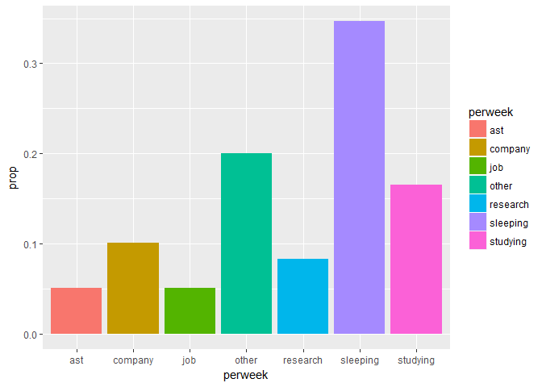
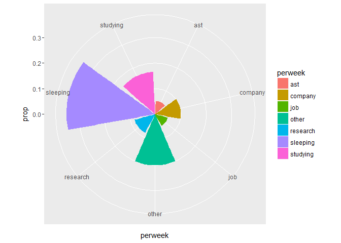
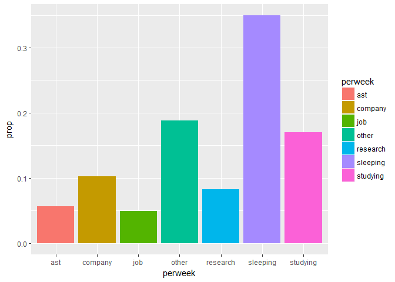
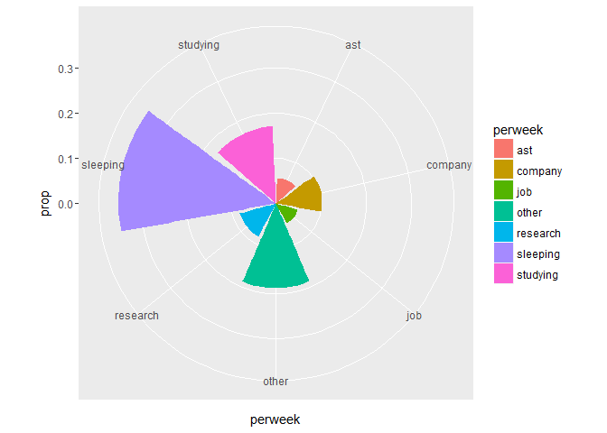
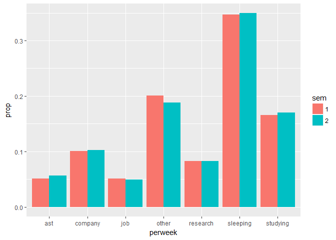

碩一生活小調查
================

clean data
==========

------------------------------------------------------------------------

平均一周的時間分配
==================

第一學期
--------

``` r
bar1 <- life1.long %>%
    group_by(perweek) %>%
    summarise(hoursw = sum(hours)) %>%
    mutate(prop = hoursw / sum(hoursw)) %>%
ggplot() +
    geom_bar(mapping = aes(x = perweek, y = prop, fill = perweek), stat = "identity")
bar1
```



------------------------------------------------------------------------

``` r
bar1 + coord_polar()
```


------------------------------------------------------------------

第二學期
--------

``` r
bar2 <- life2.long %>%
    group_by(perweek) %>%
    summarise(hoursw = sum(hours)) %>%
    mutate(prop = hoursw / sum(hoursw)) %>%
ggplot() +
    geom_bar(mapping = aes(x = perweek, y = prop, fill = perweek), stat = "identity")
bar2
```



------------------------------------------------------------------------

``` r
bar2 + coord_polar()
```



------------------------------------------------------------------------

兩學期比較
==========

``` r
b1 <- life1.long %>%
    group_by(perweek) %>%
    summarise(hoursw = sum(hours)) %>%
    mutate(prop = hoursw / sum(hoursw), sem = "1")
b2 <- life2.long %>%
    group_by(perweek) %>%
    summarise(hoursw = sum(hours)) %>%
    mutate(prop = hoursw / sum(hoursw), sem = "2")

b12 <- bind_rows(b1, b2)
ggplot(b12) +
    geom_bar(mapping = aes(x = perweek, y = prop, fill = sem), stat = "identity",
             position = "dodge")
```


------------------------------------------------------------------
