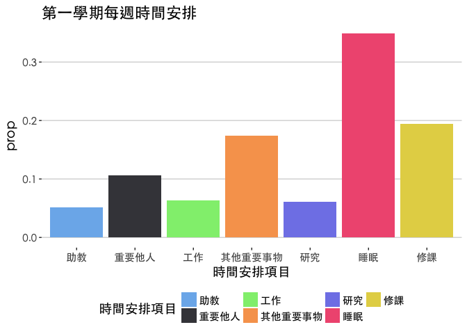
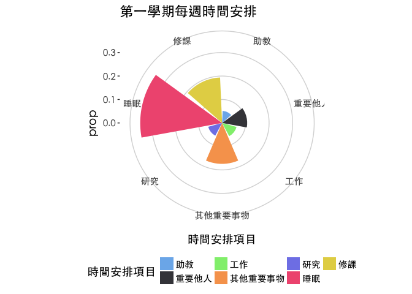
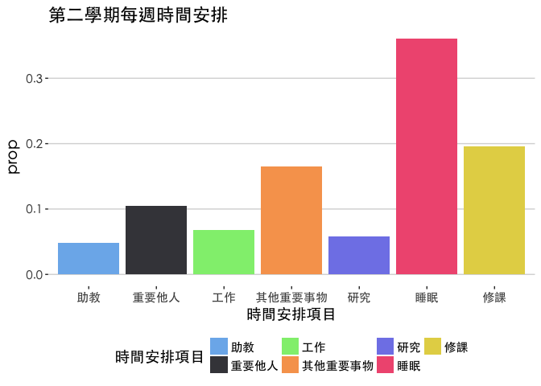
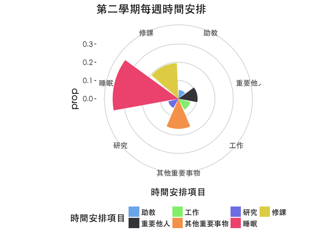
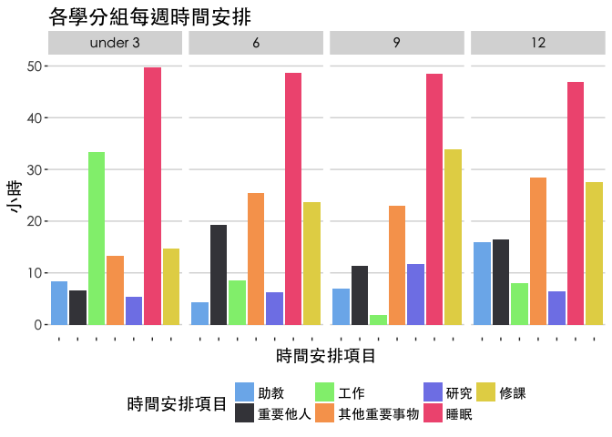
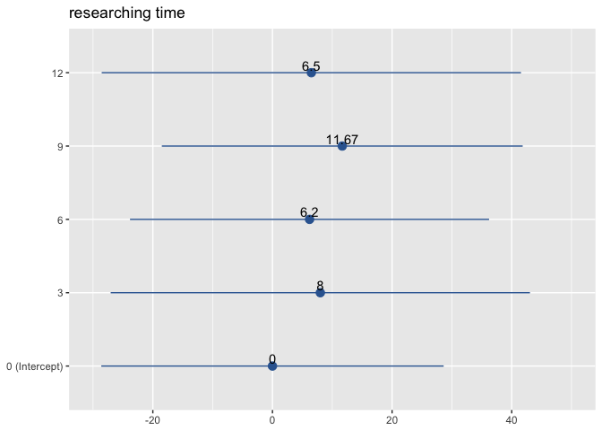

碩一生活小調查
================

clean data
==========

------------------------------------------------------------------------

mapping tools
=============

整體時間分配
============

可以由此看出各項目的分布狀況，修課時間是大家平均安排最多時間的項目，其中工作、其他和研究項目上都有較極端的 個案。

------------------------------------------------------------------------

平均一周的時間分配
==================

第一學期
--------

------------------------------------------------------------------------

------------------------------------------------------------------------

第二學期
--------

------------------------------------------------------------------------

------------------------------------------------------------------------

兩學期比較
==========

兩個學期比較起來，並沒有明顯的差別。

------------------------------------------------------------------------

各學分組比較
============

細分修課學分來看，將0學分和3學分合併，較明顯的可以發現修課時間增加會壓縮到工作的時間。

------------------------------------------------------------------------

個人狀況(不公布)
================

細分為個人的時間安排來看，修課時間是主要的時間安排，但修課的學分數並不必然排擠到從事研究的時間，但同時可能會壓縮到陪伴或從事其他事物的時間。

學分數與修課時間
================

------------------------------------------------------------------------

學分數與研究時間
================

------------------------------------------------------------------------

高研究時間組
============

若是希望能增加研究時間，則可能得犧牲工作時數，以及從事其他事物的時間，同時能負擔修課的時間也減少。

------------------------------------------------------------------------
